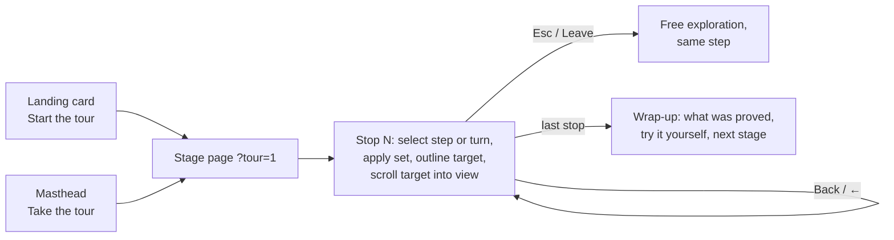

# PRD: guided tours of the three stages

## Problem

The inspector shows every CWA decision, but a visitor who opens it alone has to work out what each stage demonstrates. The explanation lives in `docs/SCENARIOS.md`, a presenter's Click / Say / Point at / Ask script, and in fragments of the UI: the step kicker, `proves` and `look_for`, the delta strip and the glossary. Nothing in the app guides a visitor through it.

## Goal

One **self-serve guided tour per stage** (basic, intermediate, advanced). At every stop the tour drives the page to the right step or turn and outlines the element it talks about. It then says, plainly:

- **Look at:** where on the screen.
- **What you see:** what the assembler did, filled from the trace and snapshot, never typed by hand.
- **Why it matters:** the problem this check prevents in an application without CWA.
- **Proves:** the reason codes and R-n requirements, as clickable reason chips that open the glossary.

The visitor never has to infer what is being demonstrated.

## Non-goals

- A presenter aid. Talk mode and SCENARIOS.md stay the presenter's tools.
- Any dependence on a live model. The tour works with no provider configured. When a provider is configured, the answer stop offers *Send*. Advanced shows the recorded reference answers.
- Any decision logic. "The pages format; they never decide" (STYLE.md). The tour quotes the trace; it never asserts an outcome the trace does not hold.

## Design

### Tour data

Each stage has one ES module, `src/inspector/public/shared/tours/{basic,intermediate,advanced}.js`, exporting `STOPS`, after the pattern of `shared/terms.js`. A stop is:

```js
{
  id: 'stale-sla',
  at: { step: '02-stale-and-foreign' },          // advanced: { run: 'reference-01-investigate', turn: 2 }
  set: { variant: 'fixture', budget: null },    // optional page settings the stop needs
  target: 'candidate:kb:sla-2025',              // a data-tour anchor key
  title: 'The stale SLA never reaches the model',
  look: 'The red cards in column 1, then the Excluded table in column 2.',
  what: '{trace.excluded.length} items excluded at admission …',  // placeholders read the trace/snapshot/meta
  why:  'Without a route predicate, a 2025 document that promises phone support is as eligible as the current one.',
  proves: ['expired', 'out_of_scope', 'below_threshold', 'R-9'],
}
```

Placeholders (`{trace.…}`, `{snapshot.…}`, `{meta.…}`, `{run.…}`) fill numbers and ids from what the assembler returned. A placeholder that doesn't resolve renders as a visible `?` and fails the tests.

### Engine

`src/inspector/public/shared/tour.js` holds pure functions, testable in node like `shared/delta.js`:

- `stopAt(stops, index)`, `next` and `back`;
- `parseTourState(search)` and `tourSearch(index)`, for `?tour=N` alongside the existing `#step` hash;
- `fill(template, sources)`, the placeholder filling.

A thin DOM layer renders the band, applies the outline and calls the page's own select function (`selectScenario`, or the advanced page's run and turn selection) through a small adapter each page passes in.

### UI



- A `#tour` band inside `header.top`, so it stays pinned while the page scrolls to the target. It is styled as STYLE.md's **note** callout (accent border on accent-soft), with one accent kicker: `TOUR · BASIC · 2 OF 13`. It holds the title, the Look at / What you see / Why it matters lines, the Proves chips, and Back, Next (labelled with where it goes, e.g. "Next: step 3 →") and Leave.
- A **Take the tour** button in the masthead of each stage, and a **Start the tour** link on each landing stage card.
- The target gets the `.tour-target` class: an accent outline, no motion, and an instant `scrollIntoView({ block: 'nearest' })`.
- While the tour is active, ← and → move between stops (instead of steps) and Esc leaves the tour. Talk mode changes sizes only. At 1024 px the band wraps; it never covers a column.
- STYLE.md rules apply in full: no transitions, no shadows, one accent, sentence-case titles, identifiers in mono and never re-cased, spec vocabulary exactly, no inflated claims, all rules in `style.css`, relative URLs only.

### Anchors

`data-tour="…"` attributes are added where the elements the tours name are rendered: `shared/panels.js`, `shared/delta.js`, the page modules and the shells. The keys:

- `columns`, `col:candidates`, `col:decisions`, `col:request`, `col:answer`
- `agreement`, `delta`, `budget-meter`
- `candidate:<item id>`
- `decisions:excluded`, `decisions:compressed`, `decisions:conflicts`, `decisions:reasons`, `decisions:context`, `decisions:recovery`
- `request`, `request:refused`, `snippets`, `answer`
- `instruments:budget`, `instruments:variant`
- `producers`, `mode`
- `agent:granted`, `agent:proposed`, `routes`, `timeline`, `turn:<n>`, `guard:<n>`, `replay`, `recorded-answer`

### Drift guards

These tests make a tour fail when a scenario, a run or a render path changes under it:

- `test/tour.test.mjs`:
  - Every stop's `at.step` exists under `scenarios/<stage>/`. For advanced, every `at.run` exists under `scenarios/advanced/runs/` and `at.turn` is within its turns.
  - Every reason code in `proves` appears in that step's `expected.trace.json`, or in that recorded turn's trace. Every R-n reference exists in the vendored contract.
  - Every advanced claim tied to a turn is asserted against `run.json`, through named checks on the stop: `expect: { denied: true }`, `{ superseded: n }`, `{ answer: true }`, `{ observationOk: false }`.
  - Every placeholder resolves against that step's frozen trace, snapshot and meta.
  - Every `target` key is emitted by some render path. A static scan of `src/inspector/public/` for `data-tour` produces the list of keys and prefixes.
- `test/inspector-pages.test.mjs`: `#tour` sits inside `header.top` in each stage shell, the masthead has a tour button, and each landing card has a tour link. The landing page's existing test that each column title appears exactly once still holds.
- The existing no-motion, colour-literal, radius and relative-URL tests cover the new CSS and markup.

## The tours

Numbers below come from the committed scenarios as of 2026-10-01. The tours fill them from the trace, not from this list.

### Basic: "Show me exactly what CWA assembled"

1. **Welcome.** One question, *What support does the Pro plan include?* The four columns, left to right. "Frozen": the same bytes go to all three assemblers. Target: `columns`.
2. **Step 1, candidates.** Five producers handed over batches, and nothing has been decided yet. Target: `col:candidates`.
3. **Step 1, decisions.** Placement order and per-item tokens. One exclusion already: the memory producer reported an expired memory without its body (`expired`, producer stage). Target: `decisions:excluded`.
4. **Step 1, agreement and context.** Three assemblers, the same bytes and the same trace; the snapshot digest and the payload hash make it replayable. Target: `agreement`, then `decisions:context`.
5. **Step 2, three exclusions.** The 2025 SLA that promises phone support (`expired`), the globex chunk (`out_of_scope`), the refunds chunk at 0.41 against 0.6 (`below_threshold`). Target: `candidate:<sla id>`.
6. **Step 2, reason registry.** Each code with its published text; the earliest applicable code is recorded, so three implementations agree. Target: `decisions:reasons`.
7. **Step 3, authority.** A retrieval item addressed to `governance.instructions` (`producer_slot_not_allowed`); a chunk claiming `tier: protected` (`tier_upgrade_not_allowed`). Target: `decisions:excluded`.
8. **Step 3, escaped injection.** Set the variant to `cwa-messages/v1`. The forum post is admitted as evidence with its `</evidence><system>` escaped: material, never structure. Target: `request`.
9. **Step 3, use it in your code.** The SDK call *is* the request: Anthropic or OpenAI SDK, TypeScript or Python. Target: `snippets`.
10. **Step 3, the answer.** With a provider: *Send* and look for the citation and the absence of phone support. Without one: what the answer would show, and why the model's answer is evaluated separately from the assembler's correctness. Target: `answer`.
11. **Step 4, budget.** The delta strip: `budget.input` 600 → 170. State dropped, summaries substituted (`compressed`), history and the Free chunk omitted (`over_budget`). Nothing truncated. Targets: `delta`, then `decisions:compressed`.
12. **Step 5, refusal.** `budget.input` 60 is below the protected content: `protected_content_over_budget`, no payload, *no model request*. Target: `request:refused`.
13. **Wrap-up.** What the five steps proved; try the budget field (`instruments:budget`) and the *frozen* button; on to the intermediate stage.

### Intermediate: "Several sources compete for a limited budget"

1. **What changed.** Real producers instead of fixtures, sources competing for one budget, a route that **requires evidence**. Target: `columns`.
2. **The producers.** A LlamaIndex BM25 pipeline over 31 documents, an account database, a memory store, and history with supplied summaries. *Replay* (the default) uses the frozen batches; *live* reruns the producers and reproduces the same digest (optional; needs `uv`). Targets: `producers`, `mode`.
3. **Step 1, duplicates in two places.** The retriever drops the near-copy (producer stage); the assembler catches the word-for-word copy (`duplicate_content`); the 2025 edition is `expired`. Target: `decisions:excluded`.
4. **Step 2, overlap.** Three chunks of one document and at most two per source (`source_diversity_cap`); a Globex document from the shared index (`out_of_scope`). Target: `decisions:excluded`.
5. **Step 3, memory.** An expired memory suppressed and reported by the producer (`expired`); another user's memory, leaked by it, excluded (`out_of_scope`). Target: `decisions:excluded`.
6. **Step 4, a fact conflict.** Account state says Pro and a memory says Free. Group `g-plan` is decided by the route's precedence, and the memory loses (`conflict_lost`). Target: `decisions:conflicts`.
7. **Step 4, an instruction conflict surfaced.** Group `g-cite` is not decided; it is surfaced in the payload for the model to see. Target: `request`.
8. **Step 5, summaries.** `budget.input` 330: prior turns and evidence chunks take their supplied summaries, and `state.user` stays whole because the route protects it. Targets: `delta`, then `decisions:compressed`.
9. **Step 6, evidence required.** An off-topic question: nothing passes the threshold (`below_threshold`), and the route requires evidence, so it refuses (`evidence_required`) with recovery `request_context`. Target: `decisions:recovery`.
10. **The answer.** The same rule as basic: no provider is needed to see the request. Target: `answer`.
11. **Wrap-up.** Conflicts declared upstream, summaries written before freezing, scope enforced at admission; on to the advanced stage.

### Advanced: "Context evolves through a controlled tool loop"

1. **What changed.** A bounded tool loop. Each turn is one inference, assembled from a frozen snapshot. The model proposes tool calls; the application decides. Target: `timeline`.
2. **Granted and proposed.** Three MCP servers propose four tools; the capability policy grants three and never offers `close_ticket`. Targets: `agent:granted`, `agent:proposed`.
3. **reference-01, turn 1.** The model asks for the account; the call is approved and becomes observation 1, `evidence.tool_results` in the next turn. Target: `turn:1`.
4. **reference-01, turn 2: denied.** The model asks for colleague `u_77`'s account. The guard denies it against the grant's scope rule, and it never executes. The denial reaches the model only as task state. Targets: `guard:2`, then `turn:3` with the task state candidate. Check: `denied` at turn 2.
5. **reference-01, supersession.** Status is checked on turns 3 and 4; in turn 5's decisions the earlier observation is `superseded` by the later one for the same call. Target: `decisions:excluded`. Check: `superseded ≥ 1` at turn 5.
6. **reference-01, turn 6: the answer.** In the output contract, naming the colleague's plan as unchecked. Target: `recorded-answer`. Check: `answer` at turn 6, `stop.turn` 6.
7. **Replay through all three.** The visitor clicks *Replay through all three*; every recorded inference goes through Python, TypeScript and Go, and each turn card gets its badge. Target: `replay`.
8. **reference-02, timeouts.** The status server times out on turns 2, 3 and 4. Each failure is an observation and a line of task state; the successes on turns 5 and 6 supersede them; the answer on turn 7 names the gap. Targets: `turn:2`, then `decisions:excluded` at turn 7. Checks: `observationOk: false` on turns 2–4, `answer` at turn 7.
9. **The second route.** `incident-agent/v1` and `incident-agent-reinforced/v1` side by side: a different placement profile, `budget.input` 620 instead of 1400, an Anthropic-style endpoint. Target: `routes`, opening the `<details>`.
10. **reference-01-investigate-reinforced.** The same scenario on the second route: the evidence chunks take their summaries, instructions are restated before the query, and the outbound request is a Messages API request. Target: `request`. Check: `denied` at turn 4, `answer` at turn 7.
11. **Wrap-up.** The bound belongs to the application, an unauthorized call never executes, and every inference can be replayed; back to the landing page.

## Working rules (AGENTS.md)

- Test-first: red, then green, then refactor.
- Commit unasked at each green step: `git commit -s`, Conventional Commits, scope `inspector` (or `docs`), with the Co-Authored-By trailer.
- Docs change in the same commit as the behavior.
- Prove each guard by breaking the code on purpose.
- Never push.
- STYLE.md's new-section checklist (STYLE.md lines 477–487) before calling a stage done.

## Known drift to fix along the way

- `docs/SCENARIOS.md:11` says 74 conformance snapshots; the README says 82.
- `docs/SCENARIOS.md:153-157`: in `reference-01-investigate` the supersession first shows in turn 5 and the answer is on turn 6, not turn 5.
- `docs/SCENARIOS.md:165`: in `reference-02-timeout` the timeouts are on turns 2, 3 and 4, the first success is on turn 5, and the answer is on turn 7.
