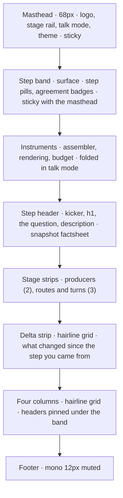
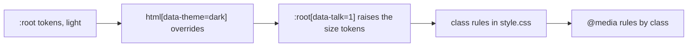

# CWA demo app style guide

This guide records the visual language the inspector shares with the CWA website, so that every page of the demo reads as one family with the site, the spec and the other assets. It is the website's style guide (measured from its pages on 2026-09-28) applied to this app: the tokens, the type, the rules and the hover states are the site's; the components are the inspector's. When a page and this guide disagree, fix the page unless the page is one of the deliberate exceptions named in section 10.

The inspector is plain HTML shells under `src/inspector/public/`, drawn by ES modules, styled by one class-based stylesheet, `src/inspector/public/style.css`. There is no framework, no build step and no inline styling beyond two runtime values (section 9). `npm test` checks the parts of this guide a test can check (section 9).

## 1. Character

Warm, flat, typographic, hairline, editorial. The inspector is an instrument, so it is denser than the site, but it is the same paper, the same ink and the same two typefaces.

- **Paper, not white.** Backgrounds are warm off-white neutrals with a hint of yellow (OKLCH hue 80 to 90), never pure white or pure black. Dark mode is the same warm hue inverted.
- **One accent.** A single clay orange carries every emphasis: kickers, links, the primary button, the current stage, and, in the inspector, a refusal and an exclusion. Nothing else is coloured except the four plane colours, which are semantic, never decorative: a candidate is coloured by the plane its slot belongs to, and by nothing else.
- **Two typefaces with strict jobs.** Space Grotesk sets everything a reader reads. IBM Plex Mono sets everything a machine or a spec would say: labels, kickers, identifiers, slot names, reason codes, counts, digests, code, the footer.
- **Hairlines and squares.** Structure comes from 1px lines and 1px-gap grids, not from shadows, gradients or rounded cards. The only radius is the pill on buttons and chips.
- **Big, tight display type.** Titles run to 60px with negative tracking and a line-height of 1, over quiet mono metadata.
- **No motion.** Hover states switch instantly. Nothing animates.
- **Colour is a decision.** A coloured thing on a stage page is always something an assembler decided or a slot's plane: an outcome, never a category, a status of the app, or decoration.

## 2. Tokens

The stylesheet declares the website's custom properties on `:root`, with the dark override on `html[data-theme="dark"]`, verbatim. Colours are authored in OKLCH; the hex columns are the sRGB values Chrome renders and exist only for handoff to tools that cannot read OKLCH.

| Token | Role | Light | Light hex | Dark | Dark hex |
|---|---|---|---|---|---|
| `--bg` | Page, column and card interiors | `oklch(0.985 0.004 90)` | `#fbfaf7` | `oklch(0.175 0.008 80)` | `#12100d` |
| `--surface` | The step band, quiet cards, candidate rows | `oklch(0.955 0.005 90)` | `#f1f0ec` | `oklch(0.215 0.008 80)` | `#1b1915` |
| `--fg` | Primary text, the active step pill, emphasis borders | `oklch(0.20 0.010 80)` | `#181611` | `oklch(0.955 0.004 90)` | `#f1f0ed` |
| `--muted` | Secondary text, labels, metadata, nav at rest | `oklch(0.52 0.010 80)` | `#6c6863` | `oklch(0.68 0.010 85)` | `#9b9891` |
| `--line` | Every border and divider | `oklch(0.885 0.006 90)` | `#dad9d5` | `oklch(0.305 0.008 80)` | `#312f2b` |
| `--accent` | Emphasis, links, primary button, refusal, exclusion | `oklch(0.60 0.20 38)` | `#dd4300` | `oklch(0.74 0.17 45)` | `#ff8244` |
| `--accent-soft` | Hover fills, note callouts | `oklch(0.94 0.035 45)` | `#ffe5d8` | `oklch(0.30 0.045 45)` | `#41261a` |
| `--p-gov` | Governance plane | `oklch(0.58 0.17 38)` | `#ca4b20` | `oklch(0.76 0.15 45)` | `#fe8f5b` |
| `--p-state` | State plane | `oklch(0.56 0.14 250)` | `#2378c3` | `oklch(0.76 0.12 250)` | `#73b6fa` |
| `--p-evid` | Evidence plane | `oklch(0.54 0.13 155)` | `#0d844c` | `oklch(0.76 0.13 155)` | `#65c98c` |
| `--p-inter` | Interaction plane | `oklch(0.54 0.15 310)` | `#8951af` | `oklch(0.76 0.13 310)` | `#ca99ef` |

Non-colour tokens shared with the site:

| Token | Value |
|---|---|
| `--sans` | `'Space Grotesk', Helvetica, Arial, sans-serif` |
| `--mono` | `'IBM Plex Mono', monospace` |
| `--pill` | `999px` |

The block the stylesheet carries, and a test compares against, verbatim:

```css
:root {
  --sans: 'Space Grotesk', Helvetica, Arial, sans-serif;
  --mono: 'IBM Plex Mono', monospace;
  --pill: 999px;
  --bg: oklch(0.985 0.004 90);
  --surface: oklch(0.955 0.005 90);
  --fg: oklch(0.20 0.010 80);
  --muted: oklch(0.52 0.010 80);
  --line: oklch(0.885 0.006 90);
  --accent: oklch(0.60 0.20 38);
  --accent-soft: oklch(0.94 0.035 45);
  --p-gov: oklch(0.58 0.17 38);
  --p-state: oklch(0.56 0.14 250);
  --p-evid: oklch(0.54 0.13 155);
  --p-inter: oklch(0.54 0.15 310);
}
html[data-theme="dark"] {
  --bg: oklch(0.175 0.008 80);
  --surface: oklch(0.215 0.008 80);
  --fg: oklch(0.955 0.004 90);
  --muted: oklch(0.68 0.010 85);
  --line: oklch(0.305 0.008 80);
  --accent: oklch(0.74 0.17 45);
  --accent-soft: oklch(0.30 0.045 45);
  --p-gov: oklch(0.76 0.15 45);
  --p-state: oklch(0.76 0.12 250);
  --p-evid: oklch(0.76 0.13 155);
  --p-inter: oklch(0.76 0.13 310);
}
```

### The inspector's own tokens

The inspector adds a type scale and a few measures, so that talk mode (section 7) can raise them in one place. They carry no colour. Every fixed size in the stylesheet is one of these or a value from the scale in section 4.

| Token | Default | Talk mode | Used for |
|---|---|---|---|
| `--fs` | `15px` | `17px` | body inside the columns and cards |
| `--fs-sm` | `14px` | `16px` | secondary body, table cells, summaries |
| `--fs-label` | `11px` | `12.5px` | uppercase mono labels, chips, column summaries |
| `--fs-kicker` | `12px` | `13.5px` | accent kickers |
| `--fs-mono` | `12.5px` | `14.5px` | identifiers, metadata, code |
| `--fs-title` | `16px` | `18px` | card and column titles |
| `--fs-h3` | `22px` | `26px` | subsection titles, empty-state titles |
| `--fs-lede` | `18px` | `20px` | the question under a step title |
| `--control` | `36px` | `40px` | select and input height, primary button |
| `--control-sm` | `30px` | `34px` | ghost buttons in rows |
| `--mast-h` | `68px` | `68px` | masthead height |
| `--band-h` | `58px` | `64px` | step band minimum height |

Talk mode is `data-talk="1"` on `<html>`, set by the masthead button and remembered in `localStorage["cwa-demo-talk"]`.

### Fonts

The faces are vendored under `src/inspector/public/fonts/` so the pages load nothing from the network: Space Grotesk as one variable latin file covering 400 to 700 (`space-grotesk.woff2`), and IBM Plex Mono at 400, 500 and 600 (`ibm-plex-mono-{400,500,600}.woff2`). Both are the latin woff2 builds Google Fonts serves, under the SIL Open Font License 1.1, with the licence text beside them (`LICENSE-Space-Grotesk.txt`, `LICENSE-IBM-Plex.txt`) and listed in `NOTICE`. The stylesheet declares them with `@font-face` and `font-display: swap`. Do not add a face or a weight: the stylesheet only ever uses 500, 600 and 700 on top of the 400 default.

## 3. Colour usage

Reference every colour through `var()`. The stylesheet contains no literal colour outside the token block; a test fails when one appears. The two permitted mixes are `color-mix(in oklab, var(--bg) 88%, transparent)` for the masthead's translucent background and `color-mix(in oklab, var(--plane) 50%, transparent)` for a compressed candidate's plane rule.

- **`--bg` and `--surface` alternate.** The page and the column interiors are `--bg`; the step band, quiet cards and candidate rows are `--surface`. On the landing page the sections alternate bg, surface, bg, each separated by a 1px `--line` top border.
- **`--fg` is for reading and for the current thing.** Body text, titles, the active step pill (`--fg` fill, `--bg` text), the emphasis panel's border, the conflict chip's border.
- **`--muted` is the default for anything secondary.** Ledes, descriptions, every label and kicker inside a card, metadata rows, nav links at rest, the footer, chips at rest. A block is muted unless it is the one thing the reader must read next.
- **`--accent` is emphasis, never texture.** Section kickers, links, the primary button, the current stage's underline, the note callout's border, text selection, and the two assembler decisions the demo is about: a refusal (the outcome band, the arrows and headers of the columns it never reaches, the *No model request* panel) and an exclusion (the reason-code chip on an excluded candidate, the strip's new codes). Never as running text, never as a large fill other than the primary button and the loud chip.
- **`--accent-soft` is a fill only.** Hover fill on clickable grid cells and the background of the note callout.
- **`--line` is every border.** Hairline grids, card borders, dividers, table rules, the ghost button and chip outline, the meter's track, the dashed borders of empty states and producer-excluded rows. Only the note callout (`--accent`), the emphasis panel and conflict chip (`--fg`), the refused candidate (`--accent`, dashed) and ghost buttons on hover (`--fg`) use another border colour.

### Plane colours

The four plane colours are the only other chroma and always mean the plane they are named for.

| Token | Plane | Slots | What the plane answers |
|---|---|---|---|
| `--p-gov` | Governance | `governance.*` | Who may direct the model |
| `--p-state` | State | `state.*` | What is true right now |
| `--p-evid` | Evidence | `evidence.*` | What the model may ground on |
| `--p-inter` | Interaction | `interaction.*` | What has happened, and what is asked |

A slot's plane is the part of its id before the dot; the page sets `--plane` on the element from it. Where the plane colours appear, and nowhere else:

- The logo mark in the masthead: a 2 by 2 grid, 18px square, 2px gap, in the order governance, state, evidence, interaction.
- Candidate rows: a 3px left border in the slot's plane (full for an included item, mixed to 50% for a compressed one), and the included chip's text.
- Segments of the budget meter in the outcome band, one per included item, coloured by its slot's plane, at 50% when the item went in as a summary.

Do not use a plane colour for a status, a category, a producer or a chart series that is not a plane.

### Outcomes

The demo's outcomes are what the assemblers decided. Each is carried by ink, the accent, the plane and weight, never by a colour of its own. Every chip carries its word: colour is never the only signal.

| Outcome | Candidate row | Chip |
|---|---|---|
| included | 3px left border in the slot's plane | plane-coloured text: "included · 51 tokens" |
| compressed | 3px left border in the plane at 50% | fg text: "compressed 66 → 30" |
| excluded by the assembler | `--line` border, id struck through, facts at 70% | accent text and border, the reason code as an identifier |
| admitted, assembly refused | 1px dashed `--accent` border, whole row at 70% | accent text and border: "admitted · assembly refused" |
| not placed | `--line` border, row at 55% | muted: "not placed" |
| reported excluded by the producer | 1px dashed `--line` border, row at 70% | muted, the reason code then "· producer" |
| in a declared conflict group | unchanged | fg text and fg border, the group id as an identifier |

The badges in the step band follow the same ladder: agreement and a met expectation are fg text on a `--line` border; an unreviewed expectation and a derived snapshot are fg text on an `--accent` border; a disagreement, an unmet expectation and a live run that differs from replay are `--bg` text on an `--accent` fill, the loudest thing on the page.

### Dark mode

The theme is an attribute, `data-theme="light"` or `"dark"`, on `<html>`. Every page reads `localStorage["cwa-theme"]` on load, defaults to `light` (a projector reads it better), and writes the choice back when the masthead toggle is pressed. The toggle's label names the theme you would switch to ("dark" while light), in the website's lowercase mono. The storage key is the website's, so a browser that chose a theme on the site opens the inspector in it. Everything else follows from the token override, so a component that only uses tokens needs no dark-mode work. The masthead's translucent background uses `color-mix(in oklab, var(--bg) 88%, transparent)` so it adapts too. `prefers-color-scheme` is not consulted.

## 4. Typography

### Families

- `var(--sans)` for titles, descriptions, the question, buttons with words, nav links, card body copy, table cells with words.
- `var(--mono)` for kickers and labels, identifiers (item ids, producer ids, run ids), slot names, reason codes, counts, tokens, dates, digests and hashes, code, the column summary lines, the step pills, ghost buttons, chips, the footer. If it would be uppercase, tracked, or read by a machine, it is mono.

### Scale

| Role | Family | Size | Weight | Tracking | Line-height | Measure | Notes |
|---|---|---|---|---|---|---|---|
| Landing headline | sans | `clamp(42px, 5.6vw, 82px)` | 700 | `-0.045em` | `0.94` | `13ch` | `text-wrap: balance` |
| Step title (h1) | sans | `clamp(34px, 4.6vw, 60px)` | 700 | `-0.035em` | `1` | `20ch` | `text-wrap: balance` |
| No-request title | sans | `clamp(28px, 3.6vw, 44px)` | 700 | `-0.035em` | `1.02` | none | in the note callout |
| Subsection, empty-state title (h3) | sans | `var(--fs-h3)` | 600 | `-0.02em` | `1.2` | none | |
| Landing stage title | sans | `22px` | 600 | `-0.02em` | `1.2` | | |
| Card and column title | sans | `var(--fs-title)` | 600 | `-0.015em` | `1.35` | | |
| Lede, the question | sans | `var(--fs-lede)` | 400 | none | `1.6` | `64ch` | `color: var(--muted)`, `text-wrap: pretty` |
| Body | sans | `16px` (landing), `var(--fs)` (columns) | 400 | none | `1.6` | `70ch` | `text-wrap: pretty` |
| Secondary body | sans | `var(--fs-sm)` | 400 | none | `1.55` | | muted: card copy, summaries, table cells |
| Nav link | sans | `14px` | 500 | none | | | |
| Button label | sans | `14px` (primary), `16px` (landing) | 600 | none | | | |
| Kicker, accent | mono | `var(--fs-kicker)` | 400 | `0.14em` | | | uppercase, `color: var(--accent)`, `margin-bottom: 14px` or `16px` |
| Label, muted | mono | `var(--fs-label)` | 400 | `0.12em` | | | uppercase, `color: var(--muted)`, `margin-bottom: 8px` to `14px` |
| Chip | mono | `var(--fs-label)` | 400 | `0.08em` | `1` | | uppercase; identifiers inside chips are `.code`: no uppercase, no tracking |
| Step pill, ghost button, producer index | mono | `var(--fs-label)` | 400 | `0.05em` | | | never uppercase: a step pill may carry a tool name, the index a producer id |
| Identifier | mono | `var(--fs-mono)` | 600 | none | `1.5` | | item, producer and run ids; linked identifiers 400 in `--accent` |
| Meta row, code, values | mono | `var(--fs-mono)` | 400 | none | `1.6` to `1.7` | | |
| Column summary, footer | mono | `var(--fs-label)` | 400 | `0.04em` | `1.5` to `1.65` | | muted, no uppercase |
| Delta value | mono | `calc(var(--fs-mono) + 1.5px)` | 600 | none | `1` | | `font-variant-numeric: tabular-nums` |

Rules that fall out of the table:

- Display sizes are fluid `clamp()` values; everything 22px and under is a fixed pixel size, held in a token where talk mode raises it. Never use `rem` or `em` for size.
- Tracking is negative on anything 16px and larger in sans (`-0.015em` on card titles to `-0.045em` on the landing headline) and positive on every uppercase mono label (`0.12em` muted, `0.14em` accent, `0.08em` in chips) and lightly on ghost pills (`0.05em`). Body text has none.
- Line-height drops as size rises: `1` for the step title, `1.02` for the no-request title, `1.35` for card titles, `1.55` to `1.6` for prose, up to `1.7` in code.
- Every paragraph and multi-line title sets `text-wrap: pretty`; balanced wrapping (`balance`) is reserved for h1 and the landing headline.
- Measure is set with `max-width` in `ch`: `70ch` for body, `64ch` for ledes, `13ch` to `20ch` for headlines.
- Weights: 700 for display and h1, 600 for h3, card titles, identifiers, buttons and inline emphasis, 500 for nav links, 400 for everything else. Never 300 or 800.
- Numbers that are compared (the delta strip, token columns) set `font-variant-numeric: tabular-nums` and align right.

### Casing and punctuation

- **Kickers and labels are uppercase mono with middle dots.** "Step 2 of 5 · basic stage", "Reference run · incident agent · advanced stage", "Stage 1 · frozen fixtures · 5 steps". Separate facets with ` · ` (space, U+00B7, space); dates are ISO.
- **Column summaries and metadata are lowercase mono with middle dots.** "3 items from 2 producers · 1 reported excluded", "cwa-messages/v1 · 81 tokens · hash abcdef01…".
- **Titles are sentence case.** Step titles come from `scenario.json` and read as sentences; column and card titles are noun phrases without a period: "Candidate context", "Outbound request".
- **The question is quoted.** Curly quotation marks around the user's question, in the lede style.
- **Identifiers are never re-cased.** Reason codes (`protected_content_over_budget`), slot names (`evidence.knowledge`), item ids and run ids appear exactly as the snapshot or trace spells them, in mono. A chip holding one is `.code` so the uppercase rule does not touch it.
- **RFC 2119 keywords** (MUST, MUST NOT, SHOULD, SHOULD NOT, MAY) are set in `color: var(--accent); font-weight: 600` in running text.
- **Requirements are cited as R-n**, as the spec numbers them.
- **Browser titles** follow "CWA demo · stage" ("CWA demo · basic"); the landing page is "CWA demo".
- Numbers are formatted with `toLocaleString("en-US")` where they exceed three digits.

## 5. Layout and spacing

### Frame

The stage pages are full width: four columns need it. The landing page uses the site's container.

| Measure | Value |
|---|---|
| Landing container | `max-width: 1180px; margin: 0 auto` |
| Side gutter | `32px`, tightened to `20px` below 900px |
| Masthead | `var(--mast-h)` (68px), sticky, `z-index: 50`, blurred `--bg` at 88% |
| Step band | `min-height: var(--band-h)`, `--surface`, sticky under the masthead in the same block |
| Instruments row | `padding: 10px 32px`, 1px `--line` bottom border |
| Step header | `padding: 32px 32px 24px`, grid `minmax(0, 1fr) minmax(320px, 400px)`, `gap: 40px` |
| Strips (producers, routes, turns) | `padding: 0 32px 24px` |
| Delta strip | `margin: 0 32px 24px`, a hairline grid |
| Columns | `margin: 0 32px 32px`, a hairline grid of four, headers sticky at `--top-h`, the measured height of the pinned block |
| Column body | `padding: 18px`, a column of cards with `gap: 12px` |
| Footer | `padding: 24px 32px`, 1px `--line` top border |
| Landing hero | `padding: 96px 32px 72px` |
| Landing section | `padding: 72px 32px 88px`, 1px `--line` top border |



The landing page replaces everything under the masthead with a hero (kicker, headline, lede, the primary button, and the four columns named once in a hairline grid), one surface section with the three stages as clickable hairline cells, and the footer.

### Spacing values

Only these gaps and paddings appear. Pick the nearest rather than inventing one.

- Micro: `1px` (hairline gutters), `2px`, `3px`, `4px`, `6px`.
- Component: `8px`, `10px`, `12px`, `14px`, `16px`, `18px`, `20px`, `22px`, `24px`, `26px`, `28px`.
- Section: `32px`, `40px`, `56px`, `72px`, `88px`, `96px`.

Common pairs: landing cells `24px 22px`; panel headers and key-value rows `12px 18px`; cards inside a column `12px 14px`; candidate rows `10px 14px`; primary button `9px 18px`; ghost button `8px 14px` or `7px 14px`; chips `3px 8px`; large buttons `15px 26px`. Vertical rhythm inside a section uses bottom margins of `14px`, `18px` or `24px`; nothing uses top margins except the `14px` spacer above a section label inside a column.

### Grid recipes

- **Hairline grid** (cells that share borders): the container carries the lines, the cells carry the fill.
  `display: grid; gap: 1px; background: var(--line); border: 1px solid var(--line);` with each cell `background: var(--bg);`. The four columns, the delta strip, the producer cards, the route cards, the turn cards, the landing pipeline and the landing stages are all hairline grids.
- **Responsive card grid:** `repeat(auto-fit, minmax(240px, 1fr))` for producer cards, `minmax(360px, 1fr)` for route cards, `minmax(200px, 1fr)` for turn cards, always as a hairline grid.
- **Key and value rows** (the factsheet, the trace context): `grid-template-columns: 120px minmax(0, 1fr); gap: 14px; padding: 12px 18px; border-bottom: 1px solid var(--line); align-items: baseline;` with the key in mono `var(--fs-label)` muted and the value in mono `var(--fs-mono)`.
- **Candidate row:** `grid-template-columns: minmax(0, 1fr); gap: 5px` inside the row; the status chips, the id, the facts, the tertiary line, the body behind a `<details>`.
- **Reasons list:** `grid-template-columns: auto minmax(0, 1fr); gap: 6px 12px`, the code in mono accent, the registry text in `--muted` with the rule in fg 600.

### Breakpoints

The stylesheet ends with `@media (max-width: …)` rules that select by class. No `!important` is needed, because nothing is styled inline.

| Max width | Rule |
|---|---|
| `1400px` | The four columns become two per row; column headers stop sticking and lose their arrows. The landing hero stacks |
| `900px` | The step header and the landing stages become one column; every gutter tightens to `20px`; the brand's subtitle hides. The producer, route and turn grids need no rule: they are `auto-fit` |
| `800px` | The columns become one; the landing pipeline (a two-by-two grid) stacks |

Layers: the masthead block sits at `z-index: 50`, column headers at `2`. Nothing else is layered.

## 6. Components

Snippets are the rules in `style.css`; hover states are ordinary `:hover` rules.

### Masthead

```css
.top { position: sticky; top: 0; z-index: 50; background: color-mix(in oklab, var(--bg) 88%, transparent); backdrop-filter: blur(12px); border-bottom: 1px solid var(--line); }
.masthead { height: var(--mast-h); display: flex; align-items: center; gap: 28px; padding: 0 32px; }
```

Order left to right: the logo mark (the 2 by 2 plane grid) and the wordmark "CWA" (`font-weight: 700; letter-spacing: -0.02em; font-size: 16px`, `--fg`) with "support-assistant demo" beside it in `14px` muted, the stage rail, a spacer (`margin-left: auto`), the talk-mode ghost button, the theme ghost button.

### Stage rail

`display: flex; gap: 24px; font-size: 14px; font-weight: 500`, links `color: var(--muted)` hovering to `--fg`, `white-space: nowrap`. Each link starts with its number in mono `var(--fs-label)`. The current stage is `--fg` with `border-bottom: 2px solid var(--accent); padding-bottom: 2px` and `aria-current="page"`.

### Step band and step pills

The band is `--surface` with a 1px `--line` top border, `padding: 11px 32px`, the steps on the left and the badges on the right (`margin-left: auto`). A step is a ghost pill (below) whose first token is its number, never uppercased, since on the advanced page the pill carries the tool the model asked for; a 12px `--line` hairline joins each pair. The shown step is the inverse pill: `background: var(--fg); color: var(--bg); border-color: var(--fg)`. On the advanced page the pills are the turns, labelled by the tool the model asked for.

### Buttons

All buttons are pills. A `<button>` always sets `font-family` explicitly because the browser default would not.

| Variant | Style | Hover |
|---|---|---|
| Primary (Send, Run live) | `font-family: var(--sans); font-size: 14px; font-weight: 600; color: var(--bg); background: var(--accent); border-radius: var(--pill); padding: 9px 18px; border: 0; cursor: pointer;` | `background: var(--fg)` |
| Inverse (the active step) | as the ghost pill, with `background: var(--fg); color: var(--bg); border-color: var(--fg)` | unchanged |
| Ghost (talk mode, theme, frozen, replay, copy, re-check) | `font-family: var(--mono); font-size: var(--fs-label); letter-spacing: 0.05em; color: var(--muted); background: transparent; border: 1px solid var(--line); border-radius: var(--pill); padding: 8px 14px; cursor: pointer;` | `color: var(--fg); border-color: var(--fg)` |
| Ghost pill (steps, producer index) | the ghost, identifiers kept as written; the producer index at `padding: 3px 8px` | same as ghost |
| Large primary (landing) | primary at `font-size: 16px; padding: 15px 26px` | `background: var(--fg)` |

Labels are sentence case: "Talk mode", "Run live", "Replay through all three", "Send to all". A disabled button is at `opacity: 0.5` with `cursor: not-allowed`; there is no loading or pressed style beyond `aria-pressed`, which the talk-mode button renders as the inverse pill.

### Form controls

Selects and number inputs (the website has none) are square hairline boxes: `font-family: var(--mono); font-size: var(--fs-mono); color: var(--fg); background: var(--bg); border: 1px solid var(--line); height: var(--control-sm); padding: 0 10px;`. Every select sits in a `.select` wrapper: the native appearance is off, the select keeps `30px` of right padding, and the wrapper's `::after` draws a 6px chevron in `--muted` 12px in from the edge, turning `--fg` with the border on hover. Every number input sits in a `.number` wrapper the same way: the native spinner is off, and the wrapper draws an up and a down chevron at the same inset; a click in that zone steps the value through `chrome.js`, the upper half up and the lower half down, and fires the change the page listens for. Their label sits above them as a muted uppercase mono label in a `.field` wrapper. Focus is a `2px` `--accent` outline, on every control.

### Links

Links are `--accent` with no underline and turn `--fg` on hover, everywhere, including in mono meta rows. Cross links end with a spaced arrow: "frozen snapshot.json →". The only text decoration is `line-through` on the id of an excluded candidate.

### Kickers and labels

```css
.kicker { font-family: var(--mono); font-size: var(--fs-kicker); letter-spacing: 0.14em; text-transform: uppercase; color: var(--accent); margin-bottom: 14px; }
.label { font-family: var(--mono); font-size: var(--fs-label); letter-spacing: 0.12em; text-transform: uppercase; color: var(--muted); margin-bottom: 8px; }
.sec { the label, with margin: 14px 0 8px; }
```

A section has one accent kicker (the step header, the delta strip, the producers, the routes, the turns); everything inside it, and every heading inside a column ("Conflicts", "Excluded", "Included (placement order)", "Context"), uses the muted label.

### Chips

One shape for badges, tags and statuses: a pill in mono. Colour is the outcome (section 3); the word is always there.

```css
.chip { display: inline-flex; align-items: center; gap: 6px; padding: 3px 8px; border: 1px solid var(--line); border-radius: var(--pill); font-family: var(--mono); font-size: var(--fs-label); letter-spacing: 0.08em; text-transform: uppercase; line-height: 1; white-space: nowrap; color: var(--muted); }
```

| Class | Text | Border | Fill | Used for |
|---|---|---|---|---|
| (none), `.gray`, `.line` | `--muted` | `--line` | none | kinds, counts, changes ("was included"), not placed, producer exclusions |
| `.ok` | `--fg` | `--line` | none | agreement, a met expectation, granted tools, live = replay |
| `.info` | `--fg` | `--line` | none | compressed, an observation |
| `.plane` | `var(--plane)` | `--line` | none | included, on an element that sets `--plane` |
| `.warn` | `--fg` | `--accent` | none | unreviewed expectation, derived snapshot, denied by the guard |
| `.bad` | `--accent` | `--accent` | none | a reason code, a refusal, an error |
| `.fill` | `--bg` | `--accent` | `--accent` | assemblers disagree, expectation not met, live ≠ replay |
| `.conflict` | `--fg` | `--fg` | none | a declared conflict group |
| `.code` | as above | | | an identifier: `text-transform: none; letter-spacing: 0; font-size: var(--fs-mono)` |
| `.dot` | | | | an 8px square swatch in `currentColor` before the text, as the legend swatches on the site |
| `.xs` | | | | `font-size: 10.5px; padding: 2px 6px` |

### Panels and cards

- **Bordered panel:** `border: 1px solid var(--line); background: var(--bg);` with an optional header bar
  `display: flex; justify-content: space-between; gap: 12px; padding: 12px 18px; border-bottom: 1px solid var(--line);` carrying a muted label. Code blocks, the payload viewer, the factsheet and each column are this panel; a column's header bar is its `<h2>`.
- **Column header:** the panel header bar, sticky, `background: var(--bg)`, holding the arrow glyph "→" in mono muted (from the second column on), the column number in mono accent `var(--fs-label)` tracked, the title in `var(--fs-title)` 600 `-0.015em`, and under them the summary line in mono `var(--fs-label)` muted. On a refusal the request and answer columns' arrows, numbers and titles turn `--accent`.
- **Hairline grid cell:** `background: var(--bg); padding: 24px 22px;` for the landing stages, `22px 22px 20px` in the landing pipeline, `16px 18px` in the strips; label, then a `var(--fs-title)` 600 title, then `var(--fs-sm)` muted copy. Clickable cells are `<a>` elements with `color: var(--fg)` and `:hover { background: var(--accent-soft); }`.
- **Candidate row:** `border: 1px solid var(--line); border-left: 3px solid var(--plane); background: var(--surface); padding: 10px 14px;` with the status chips, the id as an identifier, the facts in mono `var(--fs-label)` muted with the slot in `--fg`, the tertiary line, and the body behind a `<details>`. The outcome variants are in section 3.
- **Card inside a column** (a system entry, a tool entry, an answer, a producer's batch): `border: 1px solid var(--line); background: var(--bg); padding: 12px 14px;`.

Cards never have a shadow, a radius or a coloured background other than `--bg`, `--surface` or `--accent-soft`.

### Callouts

| Purpose | Style |
|---|---|
| Note (a refusal, *No model request*, a rejected snapshot, a provider error) | `border: 1px solid var(--accent); background: var(--accent-soft); padding: 18px 20px;` |
| Emphasis panel (an assembly's outcome band with its budget meter) | `border: 1px solid var(--fg); background: var(--bg); padding: 18px 20px;` |
| Empty state (nothing to send, no answer yet, the fixture rendering) | `border: 1px dashed var(--line); background: var(--surface); padding: 22px 16px;` with an h3 title |

There is no red, green or yellow callout. Severity is carried by the accent border or the fg border, never by a new colour.

### The budget meter

An 8px bar, `background: var(--line)`, square, inside the emphasis panel: one segment per included item, `flex: 0 0 <tokens/budget>%`, `min-width: 2px`, coloured by the item's slot plane, at `opacity: 0.5` when the item went in as a summary. Its `title` says what is used, how much of it stands for summaries, and what is free. The segments are read from the trace's `included` and `compressed` rows and the snapshot's budget; the meter computes nothing the assembler did not decide.

### The delta strip

A hairline grid under the step header: the first cell carries the kicker "Since step 1" and a muted meta line ("the step you came from"); every other cell carries a muted label and a value in the delta style, `before → after` when it changed, `after · same` in `--muted` when it did not, and on the excluded cell the reason codes new to this step as `.bad.code.xs` chips.

### Tabs

A row of text links in mono `var(--fs-label)`: the active tab is `color: var(--fg); border-bottom: 2px solid var(--accent); padding-bottom: 2px;` and inactive tabs are `--muted`, hovering to `--fg`. The snippet language and endpoint switches, and the segmented controls generally, are tabs, not pills.

### Tables

`th`: mono `var(--fs-label)`, `0.12em`, uppercase, `--muted`, `padding: 6px 8px`, 1px `--line` bottom border. `td`: `var(--fs-sm)`, `padding: 6px 8px`, 1px `--line` bottom border, `vertical-align: top`. Numeric cells are `.num`: right-aligned, tabular, `white-space: nowrap`. Identifier cells are `.m`: mono, `overflow-wrap: anywhere`.

### Code, payloads and text

- `<pre>` is the bordered panel: `padding: 18px; overflow: auto; margin: 0; white-space: pre-wrap; word-break: break-word;` in `var(--mono)` at `var(--fs-mono)`, `line-height: 1.6`. The SDK snippet adds `max-height: 460px`.
- Inline identifiers: `.mono` at `var(--fs-mono)` in `--fg`; linked identifiers in `--accent`.
- Answer text is `white-space: pre-wrap` in the body size.

### Lists

- `<ul>` inside a card: `margin: 4px 0; padding-left: 18px; font-size: var(--fs-sm); line-height: 1.6; color: var(--muted);`.
- Pipelines (a producer's steps, a route's placement): `<ol class="pipeline">` without markers, each item a mono number in `--muted` then the step, `gap: 4px`.

### Footer

`border-top: 1px solid var(--line)`, `padding: 24px 32px; display: flex; flex-wrap: wrap; gap: 24px; font-family: var(--mono); font-size: var(--fs-label); color: var(--muted);`. On a stage page it lists the assemblers' availability, each result's timing, and the arrow-key hint. On the landing page the left is the site's tagline, "Context Window Architecture is a context assembler specification, not a library.", and the right the demo's hints.

### Icons and logo

The one icon is the arrow: the "→" glyph in mono, or the 14px line arrow in the landing button (`viewBox="0 0 14 14" fill="none" stroke="currentColor" stroke-width="1.5"`). Match this stroke if you add another; do not introduce filled or two-tone icons. The logo mark is the 2 by 2 plane grid described in section 3, followed by the wordmark "CWA". There is no image, no favicon and no Open Graph image.

## 7. Motion and interaction states

- **Hover is instant.** The stylesheet declares no `transition` and no `@keyframes`; a test fails when one appears.
- Compressed, refused, unplaced and producer-excluded rows are dimmed with `opacity` (section 3), never faded in or out.
- Scrolling to a producer's batch from the index uses `scrollIntoView({ behavior: 'smooth' })`; `scroll-margin-top` keeps it under the pinned headers.

Hover conventions, in order of frequency:

| Element | Rest | Hover |
|---|---|---|
| Nav link, muted text link | `color: var(--muted)` | `color: var(--fg)` |
| Ghost button, step pill, producer index | muted text, `--line` border | `--fg` text and border |
| Clickable grid cell (landing stages, turn cards) | `background: var(--bg)` | `background: var(--accent-soft)` |
| Primary button | `background: var(--accent)` | `background: var(--fg)` |
| Accent link | `color: var(--accent)` | `color: var(--fg)` |

Selection is `--accent` on `--bg`. Interactive elements set `cursor: pointer`. Focus is `outline: 2px solid var(--accent); outline-offset: 2px` on `:focus-visible`, on every control.

**Talk mode** is the one state the website does not have: a masthead toggle, remembered per browser, that raises every size token (section 2), folds the instruments row behind one line that summarises it, and hides each candidate's tertiary line. It changes sizes, never colours or shapes.

## 8. Copy conventions

- Call it "a specification" or "the spec", never "a free specification".
- "Context Window Architecture" in full in titles and the footer, "CWA" elsewhere.
- Say "assembler", "producer", "slot", "plane", "item", "profile", "trace", "snapshot", "route" exactly as the spec does; the app's vocabulary is the spec's.
- Name the outcomes as the trace does: included, compressed, excluded, refused, rejected. A chip carries its word; colour is never the only signal.
- State what is frozen, derived, live or recorded plainly in the factsheet and the kicker. Never inflate conformance or agreement claims: "3 assemblers agree" says how many ran.
- Mono for anything quoted from a payload, a schema, a snapshot, a file name or a requirement number.

## 9. Authoring conventions

The pages are static files served by `src/inspector/server.mjs`; the markup is produced at run time by template strings in the page modules.

- **Structure:** `public/index.html` (the landing) and `public/<stage>/index.html` are the shells: the masthead, the step band, the instruments, the section elements and the four column shells with their ids. `public/<stage>/page.js` owns a stage's state and controls; `public/shared/panels.js` draws the four columns, `public/shared/delta.js` the strip and the change chips, `public/shared/chrome.js` the talk-mode and theme toggles, `public/shared/format.js` the helpers, among them `tag(text, cls, title)`, which builds every chip.
- **Classes, one stylesheet.** Every rule lives in `public/style.css` and selects by class; the shells carry no `style` attribute, and a test checks it. Class names are shared by every page, so a new class must not collide with an existing one.
- **Three inline values only.** A candidate row sets `--plane` from its slot (`style="--plane: var(--p-evid)"`), a meter segment sets its `flex-basis` and its plane, and `chrome.js` keeps `--top-h` on `<html>` at the measured height of the pinned top block, so the column headers pin under it however the badges wrap. The first two are computed from the snapshot or the trace at run time; nothing else is styled inline.
- **Theme** is `data-theme` on `<html>`, `cwa-theme` in `localStorage`. A one-line script in each shell's head applies the stored choice before the first paint; `chrome.js` owns the masthead button `#theme` and its label. **Talk mode** is `data-talk`, `cwa-demo-talk`, the button `#talk`. The landing page runs `public/landing.js`, which only initialises this chrome.
- **Responsive rules** are `@media (max-width: …)` blocks at the end of the stylesheet, selecting by class, without `!important`.
- **The pages format; they never decide.** Every status, count, colour and meter segment is read from the trace or the snapshot. A plane comes from a slot id, an outcome from a trace row. No rule here may introduce logic the assemblers own (see `AGENTS.md`).
- **Verification:** run the `inspector` launch configuration (`npm run inspector`, port 8787) rather than opening files, because the pages fetch from the server. Check both themes with the toggle, talk mode on and off, 1024px and 1440px widths, and a refusal step (basic step 5). Then run `npm test`: `test/inspector-pages.test.mjs` checks that the token block in section 2 appears verbatim in the stylesheet, that no colour literal appears outside it, that nothing declares a shadow, a transition, an animation or a radius other than the pill, that only the two families are used and their files are vendored with their licences, that no page loads anything from the network, that the shells carry no inline style, and that every page carries the theme toggle.



Left to right is the cascade order a value passes through; a later stage wins over an earlier one for the properties it names.

## 10. Known deviations

These are how the inspector differs from the website on purpose. They are recorded so that a matching page is not mistaken for a wrong one.

- **Density.** Cards inside a column are padded `12px 14px` and candidate rows `10px 14px`, not the site's `24px 22px`, because four columns share the width.
- **Form controls.** Selects and number inputs exist here and are square hairline boxes, not pills: they are fields, not buttons.
- **Focus styling.** Every control has the `2px` accent outline the site's guide recommends but the site does not yet apply.
- **Numbered rails.** Stages, steps and columns are numbered so a speaker can say where they are; the numbers are mono labels, not a new component.
- **Talk mode.** A size scale the site does not need.
- **The full-width frame.** Stage pages have no `1180px` container; the landing page does.

## 11. Checklist for a new page or section

1. Copy a stage shell (`public/basic/index.html`): the stylesheet link, the masthead with the logo mark, the stage rail, the talk-mode and theme buttons, the step band, the instruments, the section elements and the four columns. Set the `<title>` as "CWA demo · name".
2. Keep the ids the shared chrome and panels render into: `stages`, `agreement`, `talk`, `theme`, `instruments`, `instruments-toggle`, `instruments-summary`, `candidates`, `decisions`, `request`, `answer`, `foot`; the page test lists them.
3. Open the page with a kicker, a fluid h1 with `text-wrap: balance`, the question as a muted lede at `64ch`, and the factsheet as a bordered panel of key-value rows.
4. Put one accent kicker above each strip; use muted mono labels for everything inside a column.
5. Prefer a hairline grid to separate cards; keep cells square, filled with `--bg`, and hover clickable ones to `--accent-soft`.
6. Use only tokens, only the two typefaces, only the pill radius, and no shadows, gradients, transitions or animations.
7. Colour a candidate by its plane and an outcome by the ladder in section 3; give every chip its word.
8. Give any fixed multi-column grid a collapse rule at the end of the stylesheet.
9. Serve the folder, check light and dark, talk mode, 1024px and 1440px, a refusal step, and run `npm test`.
