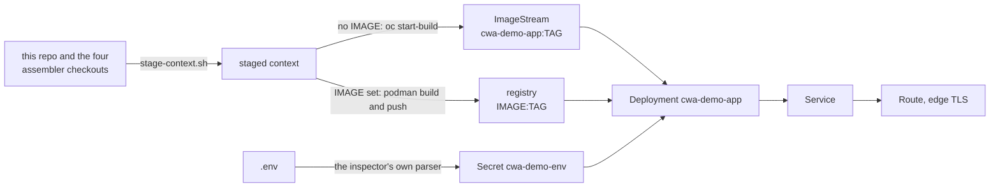

# The inspector on OpenShift

`deploy.sh` builds the image the root [Containerfile](../../Containerfile) describes and deploys it to the `oc` project you are logged into: one pod running the inspector with the four assemblers, a Service, and a public Route with edge TLS. The reference runs, the frozen scenarios and the producers are in the image, so the pages work without a model; a model is needed only for the live answer and for live agent runs.



## Before the first deploy

- `oc` logged in, with the target project selected (`oc project <name>`).
- The four assembler checkouts beside this repository, as [assemblers.json](../../assemblers.json) names them. The script stages their working trees, so what is on disk is what deploys.
- Node 22 or later and git, as for the app itself. `pnpm install` and `pnpm run setup` are not needed: the image installs and builds everything.
- For the podman path: podman, logged in to the registry (`podman login quay.io`).
- Optionally `.env` (see [.env.example](../../.env.example)) with a provider. Any model URL in it must be reachable from the cluster; a server on this machine's `localhost` is not.

## Deploy

In-cluster build (the cluster's Build capability, the default):

```bash
deploy/openshift/deploy.sh
```

Podman build, pushed to a registry (works on every cluster; `PLATFORM` defaults to `linux/amd64`, so on an Apple silicon machine the build runs under emulation and takes a while):

```bash
IMAGE=quay.io/<you>/cwa-demo-app deploy/openshift/deploy.sh
```

The script prints the Route's URL for the landing page and the three stages when the rollout is complete. Rerun it to redeploy; every step is idempotent.

### Parameters

All optional, as environment variables; [manifests.mjs](manifests.mjs) reads them and documents the defaults.

| Variable | What it sets |
| --- | --- |
| `ROUTE_HOST` | The Route's hostname. Otherwise the router generates one. A Route keeps the host it was created with: to change it, `oc delete route cwa-demo-app` first. |
| `ROUTE_PATH` | The Route's path, such as `/cwa`. The router strips it (`rewrite-target: /`) and the pages reach the server by URLs relative to their own, so the inspector is at `https://<host>/cwa/`. The trailing slash matters; the landing page adds it when it is missing. |
| `ROUTE_TIMEOUT` | The router's timeout for one request, `10m` by default: an agent run against a model takes minutes. |
| `STORAGE_SIZE` | A PersistentVolumeClaim of this size for the live agent runs, mounted over the run store; without one, live runs last as long as the pod. An init container copies the committed reference runs into the claim at every start, fresh from the image, and leaves the live runs alone. |
| `STORAGE_CLASS` | The claim's storage class. Otherwise the cluster's default class; on its own it asks for a claim of `1Gi`. |

```bash
ROUTE_HOST=cwa.apps.example.com ROUTE_PATH=/demo STORAGE_CLASS=gp3-csi STORAGE_SIZE=2Gi deploy/openshift/deploy.sh
```

To read what would be applied without a cluster:

```bash
IMAGE=example node deploy/openshift/manifests.mjs
```

## What the script does

1. **Stages the build context.** [stage-context.sh](../stage-context.sh) copies the four working trees side by side into a temporary directory, taking exactly what git lists in each: tracked and untracked files, nothing ignored, so no `node_modules`, no `.venv`, no built adapter and never `.env`. It prints each tree's revision.
2. **Computes the tag.** This repository's short SHA, plus `-dirty` when any of the four trees has uncommitted changes. `TAG=...` overrides it. The image is labelled `io.contextwindowarchitecture.revisions` with all four revisions, so its metadata says what is running.
3. **Applies the Secret.** With `.env` present, the file is read by the same Node parser the inspector uses and becomes the Secret `cwa-demo-env`, applied whole: a key removed from `.env` leaves the Secret. Only key names are printed. Without `.env`, an empty Secret is created once and never touched again, so `oc edit secret cwa-demo-env` holds until a `.env` appears here.
4. **Builds the image.** Without `IMAGE`: applies [build.yaml](build.yaml) (an ImageStream and a binary BuildConfig with the Docker strategy, its `dockerfilePath` inside the staged context), streams the context with `oc start-build --from-dir`, and tags the result with the SHA. With `IMAGE`: `podman build` and `podman push` of both the tag and `latest`, then a pull secret from podman's auth file linked to the `default` service account, in case the repository is private.
5. **Renders the objects** with [manifests.mjs](manifests.mjs) from the image reference and the parameters, applies them, restarts the Deployment so a rebuilt `-dirty` tag or a changed Secret takes effect, and waits for the rollout.

## The objects

Rendered by [manifests.mjs](manifests.mjs); `IMAGE=example node deploy/openshift/manifests.mjs` prints them.

| Object | Notes |
| --- | --- |
| Deployment `cwa-demo-app` | One replica: a live agent run is recorded on one disk and listed from it. `Recreate`, so with a claim the old pod releases it before the new one mounts it. `PORT=8787`; the Secret's variables through `envFrom`; `imagePullPolicy: Always`; probes on `/`, a static file, so they run no assembler; requests 250m CPU and 512Mi, limits 2 CPU and 2Gi (an assembly runs three adapters at once, a live producer run imports LlamaIndex). With storage, an init container `reference-runs` and the claim mounted over `scenarios/advanced/runs`. |
| PersistentVolumeClaim `cwa-demo-app-runs` | Only with `STORAGE_SIZE` or `STORAGE_CLASS`. `ReadWriteOnce`. |
| Service `cwa-demo-app` | Port 8787. |
| Route `cwa-demo-app` | Edge TLS, HTTP redirected. `haproxy.router.openshift.io/timeout` from `ROUTE_TIMEOUT`; with `ROUTE_PATH`, the path and `rewrite-target: /`. |
| ImageStream and BuildConfig `cwa-demo-app` | [build.yaml](build.yaml), the in-cluster path only. |

The image runs as a non-root user and its tree is group-writable, so the default restricted security context constraint, with its arbitrary UID, needs no change.

## Afterwards

```bash
oc get pods -l app=cwa-demo-app                 # the one pod
oc logs deployment/cwa-demo-app -f              # the inspector's log; assembler stderr is in the API responses, not here
oc get route cwa-demo-app -o jsonpath='{.spec.host}{"\n"}'
```

To change the provider: edit `.env` and rerun the script, or `oc edit secret cwa-demo-env` and `oc rollout restart deployment/cwa-demo-app`. A rerun with `.env` present replaces what was edited by hand.

To remove everything:

```bash
oc delete deployment,service,route cwa-demo-app
oc delete pvc cwa-demo-app-runs                 # if storage was asked for; this deletes the live runs
oc delete bc,is cwa-demo-app                    # the in-cluster build objects, if used
oc delete secret cwa-demo-env cwa-demo-pull     # cwa-demo-pull exists only after a podman deploy to a private repository
```

## When something fails

- **The in-cluster build cannot pull a base image.** The build pulls from `docker.io` and `ghcr.io`; Docker Hub's anonymous pull limit can bite a busy cluster. Link a pull secret for `docker.io` to the `builder` service account, or use the podman path.
- **`uv sync` fails building PyStemmer.** The producers depend on it and it has no prebuilt wheel for every platform, so the build stage carries gcc. A different failure there means the lockfile and the base image's Python disagree: the Containerfile pins both.
- **The pod is ready but the inspector shows no provider configured.** The Secret is empty, or the Deployment did not restart after it changed. List the keys without their values, then restart:

  ```bash
  oc get secret cwa-demo-env -o go-template='{{range $k, $v := .data}}{{$k}}{{"\n"}}{{end}}'
  ```

  ```bash
  oc rollout restart deployment/cwa-demo-app
  ```

- **A live answer fails with a connection error.** The model URL in the Secret is not reachable from the pod. Point it at a server the cluster can reach.
- **A live agent run returns a gateway timeout.** The Route's timeout is ten minutes; a slow model can exceed it. Set `ROUTE_TIMEOUT`.
- **The rollout waits on a pending claim.** The cluster has no default storage class, or the named one cannot provision: `oc describe pvc cwa-demo-app-runs` says which. Set `STORAGE_CLASS`, or deploy without storage.
- **The init container fails copying the reference runs.** The volume is not writable by the pod's arbitrary UID, which happens with some NFS classes. Use a class that applies the pod's `fsGroup`, or deploy without storage.
- **`oc apply` refuses the Route.** Its host changed; a Route keeps the host it was created with. `oc delete route cwa-demo-app` and rerun.
- **Under a path, the page is unstyled or the links go to the host's root.** The URL was entered without the trailing slash and something blocked the landing page's redirect. Use `https://<host><path>/`.

## Know before you share the URL

The Route is public and the inspector has no login. Anyone with the URL can run the assemblers and the producers and, with a provider configured, spend its tokens. Put it behind an OAuth proxy or a network policy, or configure no provider, if that matters for your cluster.
