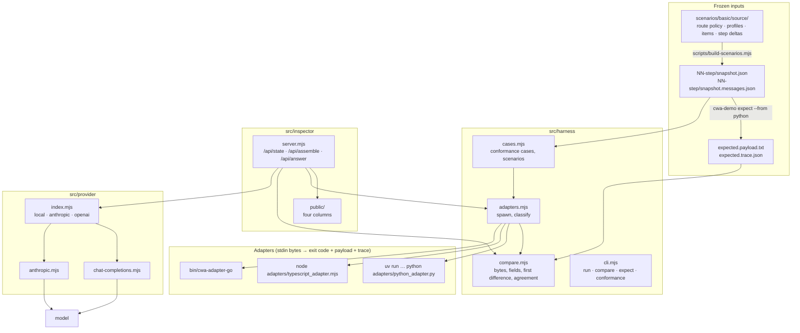
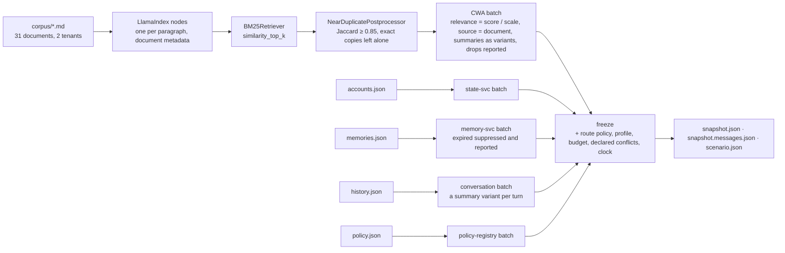
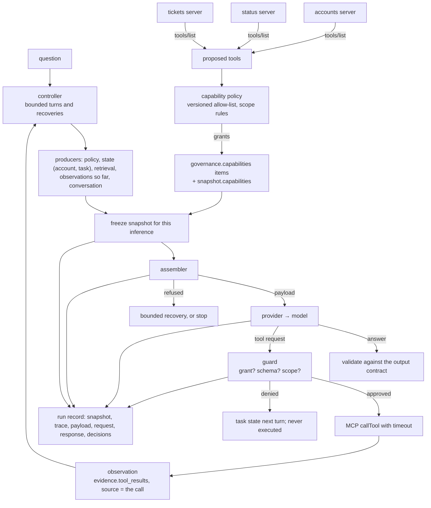

# Design

How the demo app is put together, and the rules that keep it honest. [PLAN.md](PLAN.md) says what is built and why; this says how.

## One rule

**The app never assembles.** No admission, conflict, fitting or rendering logic lives here. Every payload and trace the app shows came back from an assembler through the adapter protocol, unchanged. If a scenario needs a behavior the assemblers lack, the order is: the spec (website repo), then the assemblers, then this app.

## Pieces

### The adapter protocol

Every assembler is reached the same way, the protocol `PORTING.md` in the assembler template defines. The harness starts the command once per snapshot with the snapshot file's bytes on stdin and reads the exit code:

| Exit | Meaning | stdout |
| --- | --- | --- |
| 0 | assembled, or refused | `{"payload": base64 or null, "trace": {...}}` |
| 2 | rejected before assembly (R-17) | not read; stderr lists the problems |
| 3 | tokenizer or renderer not provided | not read; stderr names it |

`runAdapter` classifies the result as `assembled`, `refused`, `rejected`, `unsupported` or `error`. Giving the adapter bytes rather than a parsed object matters: the I-JSON checks must see the text as written, and the TypeScript assembler could have been imported in-process, but that would give it a path the others do not have.

### Comparison

`compare.mjs` follows `conformance/README.md`, Running a case:

- Payload bytes are compared byte for byte. A refusal where a payload was expected, or the reverse, is a failure with the reference runner's wording.
- Traces are compared field for field after removing only `trace_id` and `timings` (R-23). The first difference is reported as a JSON pointer, keys visited in UTF-16 code unit order (Ordering), so the report is the same one the reference runner would give.
- `unsupported` is `skipped`, never `passed`. A rejection snapshot passes only when the adapter rejected it.
- `agreement()` takes the first judged result as the reference and compares every other with it. This is the brief's three-compiler check. It does not replace the expectation: three assemblers can agree on the same mistake.

### Expectations

`cwa-demo expect --from <assembler>` writes `expected.payload.txt` and `expected.trace.json` for each rendering of each step, with `trace_id` set to the step and rendering and `timings` removed, so the files are stable. `scenario.json` records `expectations.generated_by` and `expectations.reviewed`. Regenerating a changed expectation sets `reviewed` back to `false`; an unchanged one keeps its review. The compare table and the inspector badge show unreviewed expectations as such.

The scenario tests check each expectation against itself and its snapshot: the payload's SHA-256 equals `result.hash`; `context.snapshot_digest` equals the digest of the committed snapshot, recomputed with the TypeScript assembler's exported function, so a Python-generated expectation is checked against a second implementation of RFC 8785; every reason code a step says to look for is recorded.

### Scenario generation

`scenarios/basic/source/` is the single source: `common.json` (assembly time, scope, tokenizer, the two renderers), `route-policy.json`, `profiles.json` (the fixture and messages placements, with the same `xml:` tags so the user message of the messages rendering matches the fixture payload's material), `items.json` (the clean fixture's batches) and `steps.json` (each step's metadata, budget and cumulative additions). `scripts/build-scenarios.mjs` writes the two snapshots and `scenario.json` per step, keeping `expectations` from the existing file. `--check` fails when a generated file is stale, and a test runs it.

The tokenizer is `fixture-whitespace/v1` in both renderings, on purpose: it makes the comparison portable and keeps the fitting decisions identical between the two renderings. A production route names the model's tokenizer, or `estimate-utf8/v1` with a `budget.margin_percent`.

### Producers (intermediate stage)

The intermediate stage's inputs are produced, not hand-written. `producers/` is a `uv` project whose `freeze` command runs every producer for a step and composes the snapshot:

- **Where LlamaIndex sits.** Its postprocessor interface is the seam between retrieval and response synthesis, so that is where the retriever's own duties live (R-13): a near-duplicate is dropped and reported with the chunk kept in its place. Exact copies are left alone on purpose, since the route asks the assembler for exact deduplication (R-24), and the trace then shows which stage did what. Ties in score are ordered newest first, the tie-break the route's default order uses, so the order does not depend on how the index was built.
- **The score scale is the producer's, the threshold the route's.** Relevance is the BM25 score divided by a declared scale (6.0), capped at 1, and the item's `eligibility` says so. The route's `min_relevance` is 0.3. An off-topic question scores under a quarter of the scale and is refused for lack of evidence.
- **Chunk ids carry the tenant** (`kb:acme:support-plans:v7#0`), so a shared index across tenants cannot collide; `source` is the document, so the route's `max_per_source` counts chunks per document.
- **Frozen means frozen.** The snapshot carries the clock, so a live run and a replay give the same digest; a test checks it, and the inspector's live mode shows it as a badge. The frozen `scenario.json` keeps the producers' report without timings, so `freeze --check` is stable.
- **The route protects state.user** (`tier_upgrades`), after the basic stage showed it being shed.

### The tool loop (advanced stage)

- **Proposals are not grants.** The servers say what they can do; `capabilities.json` says what this route offers, by version, and the grant travels in the snapshot so the assembler can exclude any capability the policy did not name (R-15). `close_ticket` is proposed and never offered.
- **The guard runs outside the model** (R-5). It reads only the request's name and arguments, the grant, the tool's own input schema and the application's state. A denied request produces no observation; the model learns of it from `state.task`, which the controller writes each turn, never from a fabricated tool result.
- **Observations are evidence.** Each is an `evidence.tool_results` item whose `source` names the call and its arguments, so the route's `supersede: source` keeps the latest observation of the same call and the trace records the rest as `superseded` (R-25). A timeout or a server error is an observation with an error body, and a later success supersedes it.
- **Prior turns stay in the transcript** (R-7). Each model turn, text and tool requests alike, becomes an `interaction.history` item with `lineage: generated`; the question is the one live user turn; every inference is a single-user-message request.
- **Everything is recorded.** A run holds, per inference, the snapshot, the trace, the payload, the outbound request, the response and each tool request with its decision. `replay` feeds the snapshots back through any assembler against the recorded traces; the reference runs, recorded against a real model, are the stage's regression suite.
- **The bounds are the application's.** `max_turns` and `max_recoveries` come from `common.json`. On the last turn the controller offers no tool: the grant is empty, `governance.capabilities` has no item, and the task state says so, so the only move left is the answer; a tool request made anyway is recorded as denied. A run ends with an answer (validated against the output contract's headings), a refusal with no recovery left, or the bound, and says which.
- **Two routes, compared independently.** `routes.json` names each route's policy, its placement profiles, its provider and its budget; the controller takes a route, and the run records it. Route 1 places the instructions once and keeps state ahead of evidence; route 2 (`incident-agent-reinforced`) places the instructions twice (system channel, and `<instructions>` right before the query), puts evidence and observations ahead of state and the output contract next to the query, runs under a tighter budget so the evidence chunks take their summaries as observations accumulate, and reaches the model through the Anthropic-style endpoint. The same tools, grant and guard serve both. A slot placed twice is counted twice by the assembler, and the trace shows it. The two routes also behave differently with the same model: with the instructions restated next to the query, gpt-oss re-checks the status more often, and through the Anthropic-style endpoint, which runs its reasoning mode with no effort control, it did not conclude within the bound until the last-turn rule left it nothing to do but answer. That is the point of comparing routes independently: a profile is evaluated per model and per route (R-19), not assumed.

### The inspector

`server.mjs` is `node:http`, static files and six JSON routes. `/` is a landing page; each stage has its own page under `public/<stage>/` with its own state, steps and controls, and the four columns are shared functions in `public/shared/panels.js`. Run as a program it loads `.env` first (values in the file replace ambient ones); imported by a test it does not, so a developer's `.env` cannot leak into the suite. It reads `assemblers.json`, the scenarios and the vendored contract per request, so edits show without a restart.

| Route | Does |
| --- | --- |
| `GET /api/state` | assemblers with availability, providers with configuration, scenarios with metadata |
| `GET /api/contract` | reason codes keyed by code, slot defaults, requirements |
| `GET /api/scenarios/:id/:rendering/snapshot.json` | the frozen bytes |
| `POST /api/assemble` | `{scenario, variant, assemblers?, budget?}` → the snapshot used, each result (payload as text), agreement, and the expectation judgement; a budget override derives a new snapshot, marked `derived`, with no expectation applied |
| `POST /api/answer` | `{provider, payload, reserved_output}` → the answer with the exact request that produced it |
| `POST /api/snippets` | `{payload, reserved_output}` → the request as SDK code, TypeScript and Python, per configured endpoint |
| `POST /api/produce` | `{scenario, variant, assemblers?}` → runs the stage's producers now, assembles what they built, reports how each ran, and whether the live digest equals the frozen one |
| `GET /api/agent/routes` | the routes: policy version, profile and placement, provider, budget, and what differs |
| `GET /api/agent/runs`, `GET /api/agent/runs/:id` | the recorded runs, and one run in full |
| `POST /api/agent/run` | `{scenario, route?, provider?, assembler?, faults?}` → runs the controller on a route against a real model, records the run, returns it |
| `POST /api/agent/replay` | `{run, assemblers?}` → every recorded inference through the assemblers, judged against its recorded trace |

The pages (`public/<stage>/page.js`, the columns in `public/shared/panels.js`, the chrome in `public/shared/chrome.js`) format; they never decide. Each candidate's status comes from the shown assembler's trace: an assembler-stage `excluded` row, else a `compressed` row, else an `included` row, else, on a refusal, "admitted; assembly refused". Reason codes carry the registry text as a tooltip and are listed with it under the decisions, since a projector cannot hover.

Three rails answer *where am I* on every page in the same place: the numbered stage rail in the masthead, the step progression under it (the turns of a run, on the advanced page), and the four numbered columns with an arrow between each pair. Each column header carries one line saying what the column holds, read from the response: how many items from how many producers, the trace's counts, the renderer and token count of the payload, and whether anything was sent. The decisions column's outcome band carries a budget meter drawn from the trace's token counts and the snapshot's budget; it computes nothing the assembler did not already decide. On a refusal the arrows into the request and answer columns turn dashed and red, and the request column says *No model request*. Color is reserved for outcomes (included, compressed, excluded, reported by the producer, in a conflict group, refused); navigation and selection are ink, and every chip carries its word. The page follows the OS theme. *Talk mode*, a masthead button remembered per browser, raises the type scale, folds the instruments row behind one line that summarises them, and hides each card's tertiary line. The masthead and the step band stay pinned while the page scrolls, and so do the column headers under them.

### Providers

The provider boundary takes a `cwa-messages/v1` payload and nothing else. A refused assembly has no payload, so it cannot reach a model. Mapping, per R-7:

| IR | `local` and `openai` (chat completions) | `anthropic` (Messages API) |
| --- | --- | --- |
| `system[]` | one `system` message, entries joined by a blank line | one `text` block per entry in `system` |
| `tools[]` | `tools[].function` from each entry's JSON spec | `tools[]` with `input_schema` |
| `messages[0]` | the `user` message as is | the `user` message as is |
| a surfaced conflict (`conflict`) | the entry's text prefixed with a one-line mark | the same |
| `max_tokens` | the route's `reserved_output` (`max_completion_tokens` for OpenAI) | the same |

`local` and `openai` share `chat-completions.mjs`, which uses the official OpenAI SDK: the same client reaches OpenAI and any OpenAI-compatible local server through `baseURL`, and its typed errors are reported most specific first (its connection error extends its API error, so it is tested before the general case). `anthropic.mjs` uses the official Anthropic SDK; against the real API it sends adaptive thinking and server-side refusal fallbacks, and against a compatible server (a custom `ANTHROPIC_BASE_URL`) it sends neither unless asked, since a compatible server may not know them. The captured request is the object handed to the client, so what the inspector shows is what was sent. Tests inject the client, and the inspector's API test drives the real OpenAI SDK against a mock HTTP server.

### Snippets

`snippets.mjs` renders the assembled request as the code an application writes, in TypeScript and Python: how to get the payload (`assemble`, with the refusal branch), then the literal `client.messages.create(...)` and `client.chat.completions.create(...)` calls, one per configured endpoint. The object in each call is built by the same `toRequest` the providers use, so the snippet is the request, not an illustration; the tests extract the TypeScript object and compare it with the provider's request, and run `python3` to parse the Python. The inspector fetches them for every successful `cwa-messages/v1` assembly and shows them under the outbound request.

## Testing

`npm test` runs, in about four seconds:

- `compare.test.mjs`: the judging rules on hand-built traces, including UTF-16 key order.
- `contract-lock.test.mjs`: every vendored file matches its SHA-256; nothing unlocked.
- `conformance.test.mjs`: the 74 vendored snapshots through every available assembler, judged as the reference runner judges them, and three-way agreement on each. This is the harness's self-check; an adapter that is not built is skipped, not passed. `CWA_DEMO_QUICK=1` runs five.
- `scenarios.test.mjs`: schema validity, generated files current, expectations consistent (hash, digest, reason codes).
- `inspector.test.mjs`: the API on an ephemeral port, with a mock OpenAI-compatible server so the local-model path runs end to end over HTTP.
- `mcp.test.mjs`, `guard.test.mjs`, `agent.test.mjs`, `replay.test.mjs`: the servers over stdio (proposals, the timeline, a timeout as a result), the guard's decisions, the controller with a scripted model (observations enter the next turn, supersession, a denial never executed, a timeout observed, the bounds), and the reference runs replayed through every assembler.
- `producers.test.mjs`: the committed intermediate snapshots are current (`freeze --check`), every step records its producers' report with LlamaIndex named, and a live run reproduces the frozen digest.
- `provider.test.mjs`, `provider-chat.test.mjs`: request mapping, status from the environment, dispatch, and error reporting, with the SDK client and `fetch` injected.
- `live.test.mjs` (`npm run test:live`, off by default): the step 3 request to every provider `.env` configures, against the real model. It asserts what the demo needs: text, not cut off, and the Pro citation. Model output varies, so this is a readiness check for the talk, not part of the commit gate.

The rule in AGENTS.md holds: before a test is trusted, the code is broken on purpose and the test watched failing.

## Decisions taken while building

- **Plain JavaScript, no build.** The website repo works this way; a talk demo should start with one command.
- **The TypeScript assembler runs through an adapter too**, not in-process, so no assembler has a shortcut.
- **`.env` wins over the shell.** A demo machine's config should be what the file says; a stray `ANTHROPIC_BASE_URL` in a shell once sent the Anthropic-compatible provider to the wrong host.
- **The local model is discovered.** With no `CWA_DEMO_LOCAL_MODEL`, the first model the server lists is used, so a running Ollama needs no configuration.
- **`max_tokens` is the route's `reserved_output`.** The payload was fitted to the input budget that remains after it (R-16); the model gets exactly what the route reserved. A reasoning model can spend all of it thinking and answer nothing (`stop: length`), so the local and OpenAI providers take a `reasoning_effort` setting, and the page explains an empty answer rather than showing a blank.
