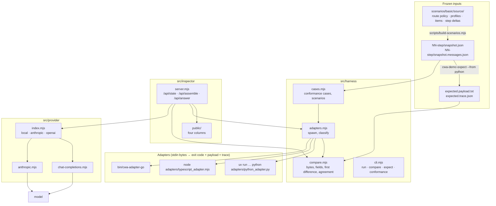

# Design

How the demo app is put together, and the rules that keep it honest. [PLAN.md](PLAN.md) says what is built and why; this says how.

## One rule

**The app never assembles.** No admission, conflict, fitting or rendering logic lives here. Every payload and trace the app shows came back from an assembler through the adapter protocol, unchanged. If a scenario needs a behavior the assemblers lack, the order is: the spec (website repo), then the assemblers, then this app.

## Pieces

### The adapter protocol

Every assembler is reached the same way, the protocol `PORTING.md` in the assembler template defines. The harness starts the command once per snapshot with the snapshot file's bytes on stdin and reads the exit code:

| Exit | Meaning | stdout |
| --- | --- | --- |
| 0 | assembled, or refused | `{"payload": base64 or null, "trace": {...}}` |
| 2 | rejected before assembly (R-17) | not read; stderr lists the problems |
| 3 | tokenizer or renderer not provided | not read; stderr names it |

`runAdapter` classifies the result as `assembled`, `refused`, `rejected`, `unsupported` or `error`. Giving the adapter bytes rather than a parsed object matters: the I-JSON checks must see the text as written, and the TypeScript assembler could have been imported in-process, but that would give it a path the others do not have.

### Comparison

`compare.mjs` follows `conformance/README.md`, Running a case:

- Payload bytes are compared byte for byte. A refusal where a payload was expected, or the reverse, is a failure with the reference runner's wording.
- Traces are compared field for field after removing only `trace_id` and `timings` (R-23). The first difference is reported as a JSON pointer, keys visited in UTF-16 code unit order (Ordering), so the report is the same one the reference runner would give.
- `unsupported` is `skipped`, never `passed`. A rejection snapshot passes only when the adapter rejected it.
- `agreement()` takes the first judged result as the reference and compares every other with it. This is the brief's three-compiler check. It does not replace the expectation: three assemblers can agree on the same mistake.

### Expectations

`cwa-demo expect --from <assembler>` writes `expected.payload.txt` and `expected.trace.json` for each rendering of each step, with `trace_id` set to the step and rendering and `timings` removed, so the files are stable. `scenario.json` records `expectations.generated_by` and `expectations.reviewed`. Regenerating a changed expectation sets `reviewed` back to `false`; an unchanged one keeps its review. The compare table and the inspector badge show unreviewed expectations as such.

The scenario tests check each expectation against itself and its snapshot: the payload's SHA-256 equals `result.hash`; `context.snapshot_digest` equals the digest of the committed snapshot, recomputed with the TypeScript assembler's exported function, so a Python-generated expectation is checked against a second implementation of RFC 8785; every reason code a step says to look for is recorded.

### Scenario generation

`scenarios/basic/source/` is the single source: `common.json` (assembly time, scope, tokenizer, the two renderers), `route-policy.json`, `profiles.json` (the fixture and messages placements, with the same `xml:` tags so the user message of the messages rendering matches the fixture payload's material), `items.json` (the clean fixture's batches) and `steps.json` (each step's metadata, budget and cumulative additions). `scripts/build-scenarios.mjs` writes the two snapshots and `scenario.json` per step, keeping `expectations` from the existing file. `--check` fails when a generated file is stale, and a test runs it.

The tokenizer is `fixture-whitespace/v1` in both renderings, on purpose: it makes the comparison portable and keeps the fitting decisions identical between the two renderings. A production route names the model's tokenizer, or `estimate-utf8/v1` with a `budget.margin_percent`.

### The inspector

`server.mjs` is `node:http`, static files and four JSON routes. It loads `.env` at startup (values in the file replace ambient ones) and reads `assemblers.json`, the scenarios and the vendored contract per request, so edits show without a restart.

| Route | Does |
| --- | --- |
| `GET /api/state` | assemblers with availability, providers with configuration, scenarios with metadata |
| `GET /api/contract` | reason codes keyed by code, slot defaults, requirements |
| `GET /api/scenarios/:id/:rendering/snapshot.json` | the frozen bytes |
| `POST /api/assemble` | `{scenario, variant, assemblers?, budget?}` → the snapshot used, each result (payload as text), agreement, and the expectation judgement; a budget override derives a new snapshot, marked `derived`, with no expectation applied |
| `POST /api/answer` | `{provider, payload, reserved_output}` → the answer with the exact request that produced it |

The page (`public/app.js`) formats; it never decides. Each candidate's status comes from the shown assembler's trace: an assembler-stage `excluded` row, else a `compressed` row, else an `included` row, else, on a refusal, "admitted; assembly refused". Reason codes carry the registry text as a tooltip and are listed with it under the decisions, since a projector cannot hover.

### Providers

The provider boundary takes a `cwa-messages/v1` payload and nothing else. A refused assembly has no payload, so it cannot reach a model. Mapping, per R-7:

| IR | `local` and `openai` (chat completions) | `anthropic` (Messages API) |
| --- | --- | --- |
| `system[]` | one `system` message, entries joined by a blank line | one `text` block per entry in `system` |
| `tools[]` | `tools[].function` from each entry's JSON spec | `tools[]` with `input_schema` |
| `messages[0]` | the `user` message as is | the `user` message as is |
| a surfaced conflict (`conflict`) | the entry's text prefixed with a one-line mark | the same |
| `max_tokens` | the route's `reserved_output` (`max_completion_tokens` for OpenAI) | the same |

`local` and `openai` share `chat-completions.mjs`, plain HTTP. `anthropic.mjs` uses the official SDK; against the real API it sends adaptive thinking and server-side refusal fallbacks, and against a compatible server (a custom `ANTHROPIC_BASE_URL`) it sends neither unless asked, since a compatible server may not know them. The captured request is the object handed to the client, so what the inspector shows is what was sent.

## Testing

`npm test` runs, in about four seconds:

- `compare.test.mjs`: the judging rules on hand-built traces, including UTF-16 key order.
- `contract-lock.test.mjs`: every vendored file matches its SHA-256; nothing unlocked.
- `conformance.test.mjs`: the 74 vendored snapshots through every available assembler, judged as the reference runner judges them, and three-way agreement on each. This is the harness's self-check; an adapter that is not built is skipped, not passed. `CWA_DEMO_QUICK=1` runs five.
- `scenarios.test.mjs`: schema validity, generated files current, expectations consistent (hash, digest, reason codes).
- `inspector.test.mjs`: the API on an ephemeral port, with a mock OpenAI-compatible server so the local-model path runs end to end over HTTP.
- `provider.test.mjs`, `provider-chat.test.mjs`: request mapping, status from the environment, dispatch, and error reporting, with the SDK client and `fetch` injected.
- `live.test.mjs` (`npm run test:live`, off by default): the step 3 request to every provider `.env` configures, against the real model. It asserts what the demo needs: text, not cut off, and the Pro citation. Model output varies, so this is a readiness check for the talk, not part of the commit gate.

The rule in AGENTS.md holds: before a test is trusted, the code is broken on purpose and the test watched failing.

## Decisions taken while building

- **Plain JavaScript, no build.** The website repo works this way; a talk demo should start with one command.
- **The TypeScript assembler runs through an adapter too**, not in-process, so no assembler has a shortcut.
- **`.env` wins over the shell.** A demo machine's config should be what the file says; a stray `ANTHROPIC_BASE_URL` in a shell once sent the Anthropic-compatible provider to the wrong host.
- **The local model is discovered.** With no `CWA_DEMO_LOCAL_MODEL`, the first model the server lists is used, so a running Ollama needs no configuration.
- **`max_tokens` is the route's `reserved_output`.** The payload was fitted to the input budget that remains after it (R-16); the model gets exactly what the route reserved. A reasoning model can spend all of it thinking and answer nothing (`stop: length`), so the local and OpenAI providers take a `reasoning_effort` setting, and the page explains an empty answer rather than showing a blank.
