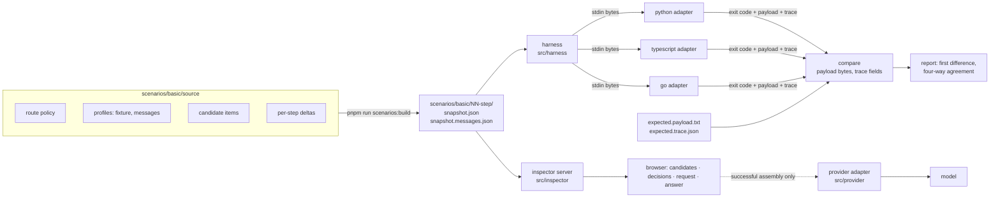

# Plan: the CWA support-assistant demo

One support-assistant demo, built in three stages, run through one comparison harness for the Python, TypeScript, Go and Rust assemblers. This document is the working plan for the **basic** stage and the frame for the two after it. [cwa-demo-setups.md](../cwa-demo-setups.md) is the brief it follows.

The demo answers one question at every stage: **what did CWA assemble, and why?** Its screen is always the same four columns:

> Candidate context → CWA decisions → outbound request → model answer

That view separates a producer error from an assembler error from an adapter error from a model error without guessing. Everything below serves it.

## Status

| Milestone | What it delivers | State |
| --- | --- | --- |
| M1 Harness | Adapters for the three assemblers, `run`, `compare`, `expect`, `conformance`; first-difference reports | done |
| M2 Scenarios | The five basic-stage snapshots, generated from one source, with expectations | done; expectations await review |
| M3 Inspector | The four-column screen in a browser, with a budget control and assembler switch | done |
| M4 Live model | Three providers through the official Anthropic and OpenAI SDKs (the local server through the OpenAI SDK's `baseURL`); captured outbound request; answer column; the request as SDK code in TypeScript and Python | done; verified against a local gpt-oss-20b through both API styles |
| M5 Talk script | `docs/SCENARIOS.md`: what to click, what to say, what each step proves | done |
| Intermediate | Competing sources under a constrained budget: LlamaIndex retrieval, an account database, a memory store, history with summaries, declared conflicts, dedupe, diversity, required evidence; live or replayed producers | done; expectations await review |
| Advanced | A bounded tool loop over three MCP servers: capability policy, guard, observations as evidence with supersession, task state, bounded recovery, every inference recorded and replayed; a second route with its own placement profile, budget and endpoint; three reference runs against a real model | done |
| Guided tours | A self-serve tour per stage on the stage page itself: each stop selects the step, outlines the place to look, and says what the assembler did, why it matters and what it proves, with every number read from the trace and every stop checked against the committed expectations; planned in Taskmaster (`.taskmaster/`, one tag per stage) | done: basic 14 stops, intermediate 11, advanced 13; on 2026-10-01 the band became the inverse rail beside the page (a dock along its foot at 1280px and below) with a flag on the stop's target, STYLE.md section 6 |

## Decisions

These were made to start work. Each is cheap to reverse now and expensive later, so they are listed for review.

1. **The app is plain Node.js (22+) ES modules, no framework and no build step.** The website repo works this way, the TypeScript assembler is a Node package, and a demo for a talk should start with one command. The browser inspector is static HTML and JavaScript served by a small `node:http` server.
2. **Every assembler runs through the adapter protocol** in `PORTING.md`: a command that takes snapshot bytes on stdin and answers by exit code (0 assembled or refused, 2 rejected, 3 unsupported tokenizer or renderer) with `{"payload": base64 | null, "trace": {...}}` on stdout. The TypeScript assembler could be imported in-process, but running it the same way as the others keeps the comparison honest: same bytes in, same bytes out, no in-process shortcut. The Go adapter already exists (`cmd/adapter`); the Python and TypeScript adapters are a dozen lines each in `adapters/`.
3. **The contract is vendored and pinned**, as in the assembler repos: `vendor/cwa/` with `vendor/cwa.lock.json`. The inspector reads reason texts and slot defaults from it, tests validate scenarios against its schemas, and `pnpm run conformance` runs its 61 cases and 25 rejections through every adapter as the harness's own self-check. A harness that cannot reproduce the published reports cannot be trusted with the demo's. The pin is website `04a36e9`, the draft dated 2026-10-04. Moving it to `65818af`, the draft dated 2026-09-30, changed the messages rendering of the two steps with a surfaced conflict, the providers (which no longer add a conflict mark of their own), the trace comparison (`recovery.detail` is no longer compared) and the glossary, and nothing else. Moving it to `20019de` brought in R-7's history order (prior turns render in the order they were said, by freshness and then by id), the optional renderer `cwa-message-blocks/v1`, which all three adapters provide, and the `cache-first-chat/v1` profile in the registry; no scenario's snapshot or expectation changed. Moving it to `04a36e9` brought in R-1's rule that unknown_slot and unknown_authority cover a value of any JSON type, with the `admission-reasons` case widened to match; no scenario's snapshot or expectation changed.
4. **Scenarios are generated from one source and frozen.** `scenarios/basic/source/` holds the route policy, two profiles, the candidate items and each step's delta; `pnpm run scenarios:build` writes each step's `snapshot.json` (fixture tokenizer and renderer, for byte-exact comparison) and `snapshot.messages.json` (the same items rendered as `cwa-messages/v1`, for the live call). The generated files are committed, and a test fails when they are stale. Frozen inputs are the point of the brief: the same bytes go to all four assemblers.
5. **Expectations are generated, then reviewed.** `pnpm run expect --from python` writes `expected.payload.txt` and `expected.trace.json` from the reference assembler. `scenario.json` records `expectations.generated_by` and `expectations.reviewed: false` until a person has read them against the spec. The compare report shows unreviewed expectations as such. Three matching assemblers can share a mistake; a reviewed expectation is the independent check the brief asks for.
6. **The basic stage uses no tools and does not require evidence.** The route's `requires_evidence` stays off so step 4 can show what a route that does not require evidence lets through; the intermediate stage turns it on. Capabilities and MCP wait for the advanced stage.
7. **The live model call is optional and needs a provider.** Three are selectable in the inspector: a local model through any OpenAI-compatible endpoint, the Anthropic Messages API (or an Anthropic-compatible server through `ANTHROPIC_BASE_URL`), and OpenAI. Each runs only from a successful assembly, and the inspector shows the exact outbound request beside the answer. `.env` holds the settings; a local model makes the talk independent of the network.

8. **Real-world connections, one per stage, at the boundary where each tool sits.** Basic: the official Anthropic and OpenAI SDKs are the last mile, and the inspector shows the assembled request as the literal SDK call in TypeScript and Python. Intermediate: LlamaIndex retrieval and postprocessing, and a LangChain memory store, as producers whose output becomes CWA batches. Advanced: MCP servers as tool producers, and an agent harness (DeepAgents or the Vercel AI SDK loop) around the assembler. Several frameworks at once would make failures hard to isolate, which the brief warns against.

## Architecture

The harness and the inspector share one module that runs an adapter and classifies its result. The inspector never assembles anything itself.

## The basic stage

**Question:** *What support does the Pro plan include?*
**Tenant:** `acme`, user `u_1042`, on the Pro plan. Producers: `policy-registry` (policy), `state-svc` (state), `kb-search` (retrieval), `memory-svc` (memory), `conversation` (interaction).
**Route:** `support-chat`, version `demo-basic/v1`. Evidence needs a rerank score of at least 0.6 and the request's tenant; memory sources must start with `turn:`; state must be under five minutes old and carry tenant and user. History sheds before evidence (`priority: -1`).
**Profiles:** `support-chat-fixture` (every slot wrapped `xml:`, renderer `fixture-xml/v1`, tokenizer `fixture-whitespace/v1`) for the comparison, and `support-chat-messages` (instructions as `system`, the rest `xml:`, renderer `cwa-messages/v1`) for the model.

Each step adds to the one before it, so the audience watches one snapshot grow and the decisions change.

| Step | What changes | Decision the trace shows | Reason codes | What it proves |
| --- | --- | --- | --- | --- |
| 1 Clean | Instructions, user state, three Pro/Enterprise/Free chunks, one memory, two history turns, the query. The memory producer reports an expired memory without its body. | Everything admitted; one producer-stage exclusion carried into the trace | `expired` (producer) | Placement order, rendering, token counts, hash, digest; three assemblers agree byte for byte |
| 2 Stale and foreign | A 2025 SLA chunk whose `expires` has passed, a chunk scoped to tenant `globex`, a refunds chunk scoring 0.41 | Three admission exclusions, each with the earliest applicable code | `expired`, `out_of_scope`, `below_threshold` | Eligibility is the route's predicate, applied outside the model; the stale SLA that says Pro has phone support never reaches the request |
| 3 Authority | A retrieval item addressed to `governance.instructions`; a chunk claiming `tier: protected`; a forum post containing `</evidence><system>…` | Two exclusions; the forum post is admitted as evidence and rendered escaped inside its wrapper | `producer_slot_not_allowed`, `tier_upgrade_not_allowed` | A producer's kind bounds its slots whatever its items say; injected markup is material, never structure |
| 4 Budget | `budget.input` lowered | State dropped first (droppable), Enterprise and Pro chunks replaced by their summaries (`compressed[]`), history turns omitted, the lowest-ranked chunk omitted | `over_budget` | Tier order, supplied variants, route fitting order; every omission is a trace row |
| 5 Refusal | `budget.input` lowered below the protected content | Refused, no payload, `result: null`; the inspector shows *no model request* | `protected_content_over_budget` | Protected content is never truncated; a refusal never reaches the model |

**Pass criteria** (from the brief): expected payload bytes and trace match for every assembler on every step; protected content is intact or assembly refuses; a refusal never produces a model request.

**What it does not prove:** that the model is immune to injection, or that the answer is correct. Step 3 shows the injected text arriving escaped; what the model does with it is the live column's business, evaluated separately.

## Milestone detail

### M1 Harness

- `assemblers.json`: the adapter command for each assembler, relative to the repo, with an environment override each.
- `adapters/python_adapter.py`, `adapters/typescript_adapter.mjs`; `scripts/setup.sh` builds the Go adapter from `../assembler-go/cmd/adapter` into `bin/`.
- `src/harness/adapters.mjs`: run one adapter on snapshot bytes; classify the outcome as `assembled`, `refused`, `rejected`, `unsupported` or `error`.
- `src/harness/compare.mjs`: payload bytes byte for byte; traces field for field without `trace_id`, `timings` and `recovery.detail`; the JSON pointer of the first difference, as the reference runner reports it.
- `src/harness/cli.mjs`: `run`, `compare`, `expect`, `conformance`.
- Tests: the compare logic on hand-built traces; the conformance self-check for every available assembler (skipped, not passed, when an adapter is not built).

### M2 Scenarios

- `scenarios/basic/source/`, `scripts/build-scenarios.mjs`, the five generated pairs, `scenario.json` per step with title, description, what it proves, the reason codes to look for, and the expectation provenance.
- Tests: every snapshot validates against `snapshot.schema.json`; every expected trace validates against `trace.schema.json`; the expected payload's SHA-256 equals `result.hash`; the expected trace's `snapshot_digest` equals the digest of the committed snapshot; the generated files are current.

### M3 Inspector

- `src/inspector/server.mjs`: `GET /api/scenarios`, `GET /api/scenarios/:id`, `POST /api/assemble`, `GET /api/contract`, static files.
- `src/inspector/public/`: the four-column screen. Candidates grouped by producer with each item's slot, authority, trust, tier, freshness, expiry, scope and score, colored by outcome. Decisions: included with tokens, compressed with from/to and variant, excluded with the reason and its registry text, conflicts, defaults filled, refusal and recovery, result tokens, hash and digest. Request: the payload as text, or a *no model request* panel. Answer: disabled until M4.
- A budget field that derives a new snapshot from the step (labelled as derived, with its own digest) and reassembles, so steps 4 and 5 can be found live. An assembler switch: one, or all four with an agreement badge.

### M4 Live model

- `src/provider/chat-completions.mjs` (local and OpenAI) and `src/provider/anthropic.mjs`: `cwa-messages/v1` payload to a request: `system` entries as system text, `tools` entries as tool definitions (none in the basic stage), the single user message as is. The request is captured and shown beside the answer. Settings come from `.env` or the environment; `max_tokens` is the route's `reserved_output`.
- `POST /api/answer` on the server, with a provider picker, send to one or to all, in the answer column.

### M5 Talk script

- `docs/SCENARIOS.md`: the five steps as a script: click, say, point at. Include the two questions to ask the audience at each step (what would have happened without this check; where is that decision recorded).

## The intermediate stage

**Question:** *Given my account and our previous conversation, what support am I entitled to?* **Route:** `support-entitlement/v1`: requires evidence (one chunk at least), exact deduplication and two chunks per source on evidence, a fact policy for `plan` (state service before memory store), instruction conflicts surfaced, history compressed before evidence, `state.user` protected. **Producers:** `producers/` (see DESIGN.md), run live or replayed. **Steps:** retrieval with copies and an expired edition; a wider retrieval with the diversity cap and a foreign tenant; an expired and a leaked memory; the plan conflict and the surfaced citation conflict; summaries under budget; and an off-topic question refused for lack of evidence. The scenario tests, the producer tests and `compare` cover all six in both renderings.

## The advanced stage

**Question:** *Check my current support entitlement, investigate the incident in my region, and draft the next action.* **Route:** `incident-agent/v1`: requires evidence; `evidence.tool_results` superseded by source and aged out after an hour; `state.user` and `state.task` protected; an output contract placed. **Tools:** three MCP servers propose four tools; `capabilities.json` grants three with scope rules. **Controller:** `src/agent/controller.mjs`, at most seven turns and two recoveries, a two-second tool timeout. **Runs:** `reference-01-investigate` and `reference-02-timeout`, recorded against the local gpt-oss-20b, committed under `scenarios/advanced/runs/`, replayed by the tests through every assembler. **Second route:** `incident-agent-reinforced/v1` in `routes.json`: instructions placed twice, evidence and observations ahead of state, the output contract next to the query, `budget.input` 620, the Anthropic-style endpoint; `reference-01-investigate-reinforced` records it. The controller offers no tool on its last turn, so a run that keeps requesting tools still ends with an answer. **Not yet:** persisting the memory proposal.

## Reuse in the later stages

The harness, the inspector's shared columns and the provider adapters did not change across the three stages. What each stage added sits at its own boundary: fixtures, then producers, then a controller around the assembler.

## Open questions for the maintainer

1. Are the reason codes and steps above the ones you want on stage, or should step 3 also show `untrusted_content_unmarked` (an evidence item a retriever forgot to mark)?
2. Should step 5 stay `protected_content_over_budget`, or would `evidence_required` with its recovery action be the stronger closing beat for the basic stage? The brief puts `evidence_required` in the intermediate stage; this plan follows it.
3. The expectations are generated by the Python reference and unreviewed. Reviewing the ten expected traces against the spec (about twenty minutes) turns the badge green and makes the comparison independent of any assembler.
4. Which model on stage? The local gpt-oss-20b answers in three to seven seconds with the citation. `Send to all` with Anthropic or OpenAI configured shows the same request going to several models, if the room has network.
